# Project 4 – Food E-Commerce Store

## Introduction
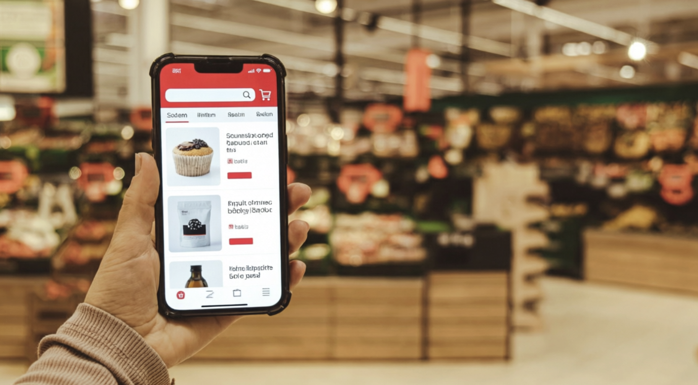


**Project 4** is a full-stack e-commerce web application designed to provide a modern and seamless online shopping experience for food products. Unlike the original course walkthrough project it was initially based on, this version has been fully **redesigned with custom styling, navigation, and features**, creating a unique and user-focused platform.


### Navigation & Browsing
The store features an intuitive navigation bar with the following categories:  

- All Products  
- Whole Foods  
- Frozen  
- Meat & Poultry  
- Hot Beverages  
- Cold Drinks  
- All Foods  
- All Drinks  
- Deals  

Each category is powered by dynamic filtering logic that updates product listings in real time. The backend supports responsive data handling, while the frontend ensures a smooth and user-friendly shopping experience. Customers can browse products efficiently, view detailed product pages, and manage their cart seamlessly.


### Full-Stack Features
Project 4 demonstrates full-stack development best practices, including:  

- Custom database design and models  
- User authentication and admin controls  
- CRUD operations for managing products, including image uploads  
- Responsive design for both desktop and mobile  
- Deployment to a cloud platform with secure environment variables  


### Documentation Purpose
This README provides **comprehensive technical and design documentation** of the project—including goals, architecture, features, technologies, and future enhancements—showcasing the transformation from a template-based project to a fully customised e-commerce application.

Welcome to **Project 4** — where thoughtful design meets practical online food shopping.

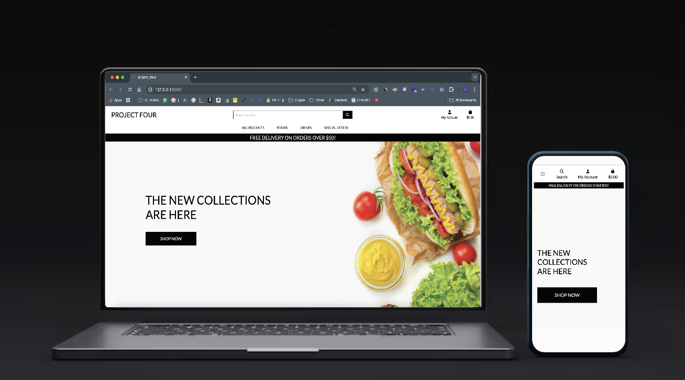


## Table of Contents
1. [Introduction](#introduction)
2. [Strategy Plane](#strategy-plane)
   - [Project Goals](#project-goals)
   - [Target Audience](#target-audience--product-categories)
   - [Problem Statement](#problem-statement)
   - [Key Features](#key-features)
3. [Scope Plane](#scope-plane)
   - [Feature Planning](#feature-planning)
   - [Minimum Viable Product (MVP)](#minimum-viable-product-mvp)
   - [Customisation & Improvements](#customisation--improvements)
4. [Structure Plane](#structure-plane)
   - [User Stories](#user-stories)
   - [User Flow Diagram](#user-flow-diagram)
   - [User Flow Image](#user-flow-image)
5. [System Architecture](#system-architecture)
   - [Frontend Architecture](#frontend-architecture)
   - [Backend Architecture](#backend-architecture)
   - [MVT Layer Mapping](#mvt-layer-mapping)
   - [External Integrations](#external-integrations)
   - [Tech Stack Summary](#tech-stack-summary)
   - [Architecture Diagram](#architecture-diagram)
   - [Notes on Performance & Scalability](#notes-on-performance--scalability)
6. [API Design & Endpoints](#api-design--endpoints)
   - [Stripe API](#1-stripe-api)
   - [Gmail API](#2-gmail-api-via-google-oauth)
7. [Database Design](#database-design)
   - [Schema Overview](#schema-overview)
   - [Models & Relationships](#models--relationships)
   - [Data Validation & Integrity](#data-validation--integrity)
   - [Schema Diagram](#schema-diagram)
   - [Notes](#notes)
8. [Authentication & Authorization](#authentication--authorisation)
   - [User Registration & Login](#user-registration--login)
   - [Permissions & Access Control](#permissions--access-control)
9. [Skeleton Plane (Wireframes)](#skeleton-plane-wireframes)
   - [Wireframes Overview](#wireframes-overview)
   - [Wireframe Images](#wireframe-images)
10. [Surface Plane (UI Design)](#surface-plane-ui-design)
    - [Mobile-First Design](#mobile-first-design)
    - [Colour Scheme](#colour-scheme)
    - [Typography](#typography)
    - [Imagery & Icons](#imagery--icons)
11. [Features](#features)
    - [User Dashboard](#user-dashboard)
    - [Search & Filter](#search--filter)
    - [Error Handling & Feedback](#error-handling--feedback)
12. [Frontend Implementation](#frontend-implementation)
    - [Templates & Components](#templates--components)
    - [Client-Side Logic](#client-side-logic)
13. [Backend Implementation](#backend-implementation)
    - [Views / Controllers](#views--controllers)
    - [Business Logic](#business-logic)
14. [Testing](#testing)
    - [Manual Testing](#manual-testing)
    - [Automated Testing](#automated-testing)
    - [Validation Testing](#validation-testing)
15. [Security, Deployment & Technology](#security-deployment--technology)
    - [Security Considerations](#security-considerations)
      - [Data Protection](#data-protection)
      - [Environment Variables](#environment-variables)
    - [Accessibility](#accessibility)
    - [Deployment & Local Development](#deployment--local-development)
      - [Deployment](#deployment)
      - [Deployment Diagram](#deployment-diagram)
      - [Environment Configuration](#environment-configuration)
      - [Local Development Setup](#local-development-setup)
        - [How to Fork](#how-to-fork)
        - [How to Clone](#how-to-clone)
16. [Technologies Used](#technologies-used)
    - [Languages](#languages)
    - [Frameworks & Libraries](#frameworks--libraries)
    - [Tools & Services](#tools--services)
17. [Future Enhancements](#future-enhancements)
18. [Credits & Acknowledgments](#credits--acknowledgments)


## Strategy Plan
## Skeleton Plane (Wireframes)
Wireframes were created to map out the **core layout and user interactions** for Project 4 before development began. They follow a **mobile-first, low-fidelity approach**, focusing on clarity, hierarchy, and usability rather than visual polish. 

- **Homepage Wireframe**: Full-width hero image with persistent top navigation bar and minimal content to encourage exploration via category links.
- **Product Listing Page**: Responsive grid of product cards showing **image, name, price, and rating**. Filters are displayed in the navigation bar or sidebar.
- **Product Detail Page**: Includes a larger product image, detailed description, price, and an “Add to Cart” button.
- **Checkout Flow**: Cart summary followed by secure card input via **Stripe Elements**.


### Wireframe Images
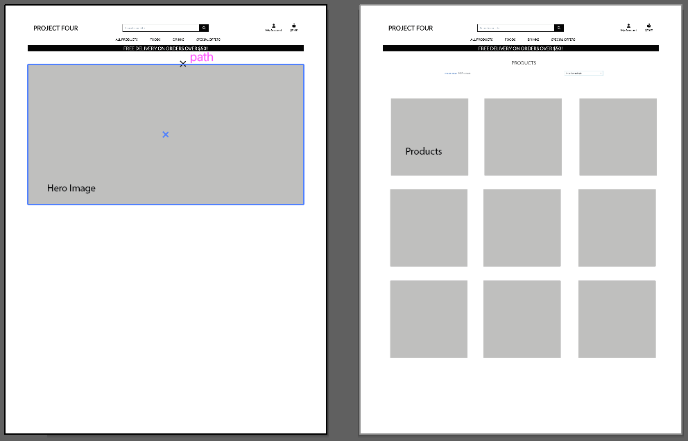
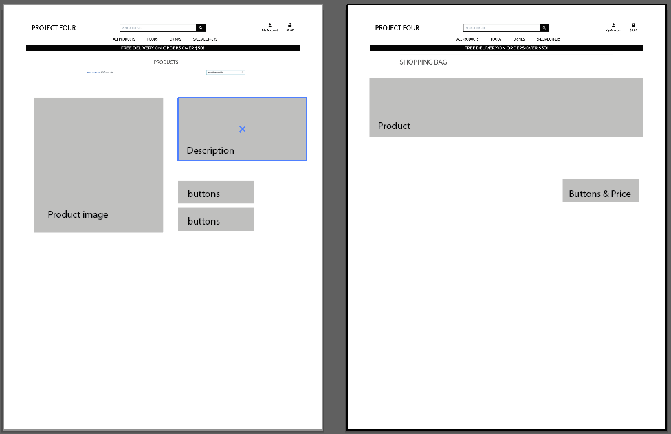

> These wireframes acted as a blueprint for development, ensuring the HTML and Django templates aligned with intended user flows and functionality.


### Project Goals
The primary goals of **Project 4** are to:

- Deliver a fully functional, responsive e-commerce platform focused exclusively on food and beverage products.
- Provide an intuitive user experience with clear navigation, dynamic filtering, and seamless product discovery.
- Implement secure user authentication, persistent shopping carts, and reliable data handling.
- Demonstrate mastery of full-stack development principles—including frontend interactivity, API integration, database modelling, and deployment best practices.
- Create a scalable foundation that can support future enhancements such as user reviews, inventory management, or email notifications.

---

### Target Audience & Product Categories
**Project 4** is designed for everyday consumers who value convenience, variety, and clarity when shopping for food online. Key user groups include:

- **Busy professionals** seeking quick, reliable access to groceries without visiting physical stores.
- **Students and young adults** looking for affordable, easy-to-prepare meals and snacks.
- **Health-conscious shoppers** interested in whole foods, fresh produce, and transparent categorisation.
- **Casual browsers** exploring deals, new arrivals, or seasonal offers.

The interface prioritises simplicity, fast loading, and mobile-friendly design to accommodate users across devices and technical comfort levels.

| User Segment           | Needs / Goals                         | Features Supporting Them                  |
|------------------------|--------------------------------------|------------------------------------------|
| Everyday Shoppers      | Quick access to essentials           | All Products, Deals, Cart, Search        |
| Health-Conscious Users | High-quality fresh and organic foods | Whole Foods, Fresh Produce, Sorting      |
| Beverage Lovers        | Hot & cold drink selection            | Hot Beverages, Cold Drinks               |
| Budget Shoppers        | Discounts and promotions              | Deals, Filter & Sort by Price            |

---

### User Journey / Flow
Users can navigate the website as follows:

1. **Homepage → Browse Categories → View Product → Add to Cart → Checkout → Order Confirmation**
2. Registered users can view past orders, and update account details.
3. Admin users can add, update, or remove products, and manage user orders.(CRUD)

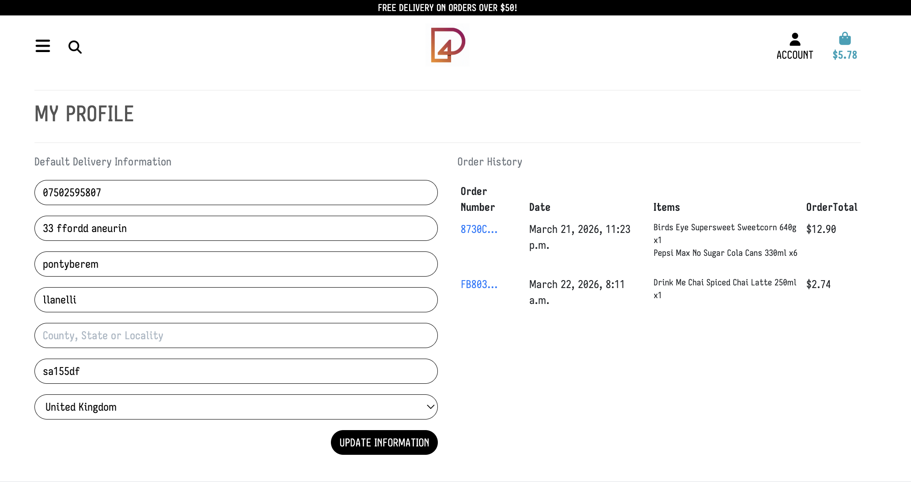

---

### Key Screenshots
**Homepage**  
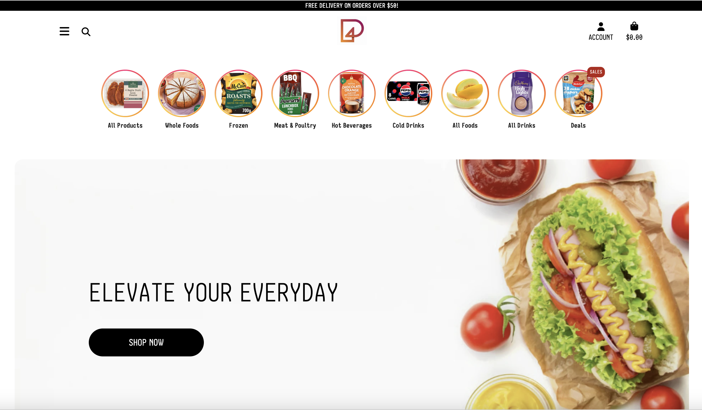

**Navigation & Filters**  
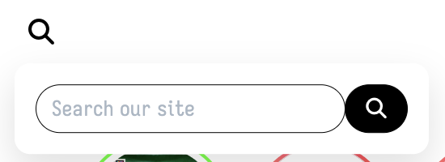
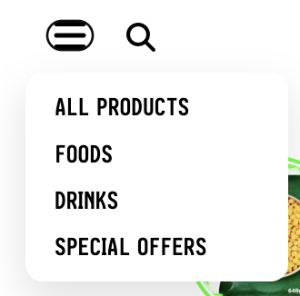
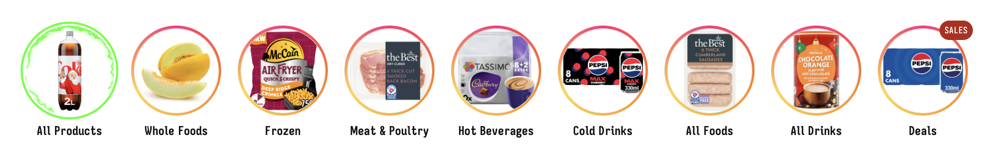

**Shopping Cart & Checkout**  
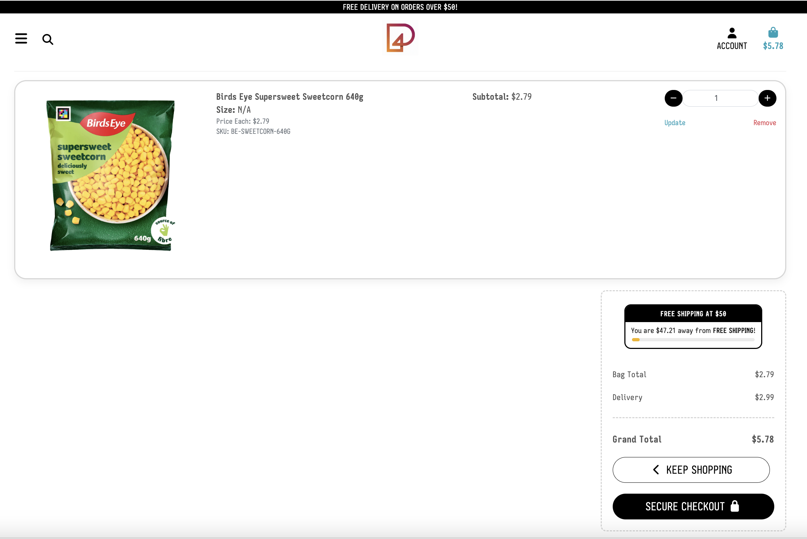

---

### SWOT Analysis

| Factor        | Details                                      |
|---------------|----------------------------------------------|
| Strengths     | Custom design, full-stack functionality     |
| Weaknesses    | Small product catalog (initially)           |
| Opportunities | Expansion into delivery, loyalty program    |
| Threats       | Competitors like Tesco, ASDA, Sainsbury's  |


### Problem Statement
Many existing food e-commerce platforms suffer from cluttered interfaces, poor filtering logic, or overwhelming product lists that make it difficult for users to find what they need quickly. Smaller or concept-focused stores often lack robust technical foundations, leading to slow performance, inconsistent navigation, or limited functionality.

Additionally, template-based implementations can result in generic user experiences with limited customisation and unclear product discovery pathways.

**Project 4** addresses these issues by focusing on a simplified, category-driven shopping experience with clear navigation and structured product discovery—allowing users to browse efficiently and complete purchases with minimal friction.


### Key Features
- **Custom Category-Based Navigation**: Structured browsing using clearly defined categories such as *Whole Foods*, *Frozen*, *Meat & Poultry*, *Drinks*, and *Deals*.
- **Dynamic Filtering & Sorting**: Server-side filtering and sorting by category, price, and rating using Django views and ORM queries.
- **Responsive Product Listings**: Consistent card-based UI displaying product image, name, price, and rating across all devices.
- **User Authentication**: Secure registration and login system using Django’s built-in authentication framework.
- **Session-Based Shopping Cart**: Persistent cart functionality using Django sessions, allowing users to maintain state across page reloads.
- **Streamlined Checkout Flow**: Integrated Stripe payment system with secure payment handling and order confirmation.
- **Mobile-First Design**: Fully responsive layout optimised for mobile, tablet, and desktop users.


## Scope Plane
### Feature Planning
To maintain focus and ensure timely delivery, features for **Project 4** were prioritised based on user needs, technical feasibility, and assignment requirements. The planned features are grouped as follows:

**Core Features (Included in MVP):**
- User authentication (registration, login, and session management via Django auth)
- Product browsing by main categories (*Foods*, *Drinks*, *All Products*, *Special Offers*) and subcategories (e.g., *Frozen*, *Meat & Poultry*, *Hot Beverages*)
- Dynamic filtering and sorting by price, rating, and category
- Responsive product listing and detail pages with images, descriptions, and pricing
- Shopping cart functionality (add, update quantity, remove items) with persistence across sessions
- Secure checkout flow powered by **Stripe**, including payment intent creation and success/cancel handling
- Order confirmation display post-payment

**Enhanced Features (Implemented or Planned):**
- Form validation for user registration and checkout inputs
- Error handling and user feedback (e.g., “Item added to cart”, “Payment successful”)
- Mobile-responsive design using hand-written CSS
- Email notifications: Automated order confirmation emails are sent after successful Stripe payments using the Gmail API, with secure OAuth 2.0 authentication
- Basic order association for authenticated users


### Feature Justification

| Feature              | Purpose                          | Technical Implementation        | User Benefit                          |
|---------------------|----------------------------------|---------------------------------|---------------------------------------|
| Category Navigation | Organise products                | Django views + URL routing      | Faster browsing                       |
| Dynamic Filtering   | Sort products                    | Django ORM queries              | Relevant product discovery            |
| Session-Based Cart  | Store cart state                 | Django sessions                 | Seamless shopping                     |
| Stripe Checkout     | Handle payments                  | Stripe API + webhooks           | Secure transactions                   |
| Authentication      | Control access                   | Django auth system              | Account security & order tracking     |

**Out-of-Scope (Not Implemented in This Version):**
- Admin dashboard for managing products (product data is seeded via fixtures or Django admin only)
- User reviews or ratings submission
- Inventory/stock-level tracking
- Password reset or advanced account management

This structured approach ensures a robust, secure, and user-focused e-commerce experience while maintaining clear project scope and development boundaries.

---


### Customisation & Improvements
Built from an initial course template, Project 4 has been fully redesigned with custom styling, navigation, and features, delivering a unique and user-focused shopping experience.

- Redesigned navigation structure to support supermarket-style browsing
- Simplified homepage to focus on category-driven discovery
- Custom product categorisation (e.g., Whole Foods, Frozen, Meat & Poultry)
- Streamlined checkout flow with reduced steps
- Improved UI with a minimal black-and-white design for clarity and accessibility

These changes demonstrate a clear departure from the original walkthrough project, showing a fully customised implementation tailored specifically to a food e-commerce use case.

---


### Minimum Viable Product (MVP)
The **Minimum Viable Product (MVP)** for **Project 4** focuses on delivering a complete end-to-end e-commerce workflow, from product discovery to payment processing.

The MVP includes the following core components:

1. **Product Discovery**
   - Category-based navigation using Django views and URL routing
   - Server-side filtering via ORM queries

2. **Product Interaction**
   - Product detail pages rendered dynamically from database models
   - Add-to-cart functionality using Django sessions

3. **User Authentication**
   - Secure login and registration via Django’s authentication system
   - Restricted access to checkout for authenticated users

4. **Checkout & Payment**
   - Stripe PaymentIntent created server-side
   - Secure card input handled via Stripe Elements
   - Webhook verification to confirm successful transactions

5. **Order Handling**
   - Order records created only after verified payment
   - User linked to each order for future scalability
   - Automated email confirmation sent to the user after successful payment

This MVP ensures that all critical e-commerce functionality is implemented securely and reliably, forming a strong foundation for future expansion.

This scoped approach ensured that development remained focused on delivering a complete and functional e-commerce experience, while also establishing a clear foundation for future improvements and scalability.


## Structure Plane
### User Stories
User stories capture the core functionality of **Project 4** from the perspective of real users. Each story follows the format:  
*"As a [type of user], I want to [perform an action] so that [I achieve a goal]."*

- **As a guest shopper**, I want to see a clean landing page with clear navigation so I can quickly choose what to browse.
- **As a visitor**, I want to explore food and drink categories directly from the navbar (e.g., *Foods*, *Drinks*, *Special Offers*) so I don’t have to search blindly.
- **As a shopper**, I want to filter foods by type (*Frozen*, *Whole Foods*, *Meat & Poultry*) or drinks by temperature (*Hot Beverages*, *Cold Drinks*) so I can find relevant items fast.
- **As a returning user**, I want to log in so my cart and session data are preserved.
- **As a new user**, I want to register easily so I can proceed to checkout securely.
- **As a customer**, I want to add products to my cart and review them before paying.
- **As a buyer**, I want to complete payment using **Stripe** so my transaction is secure and reliable.
- **As a mobile user**, I want the navigation and filters to work smoothly on small screens so I can shop anywhere.

These stories ensured the interface remained **focused, intuitive, and aligned with actual shopping behaviour**.

---


### User Flow Diagram
The user journey in **Project 4** begins with a streamlined landing experience and progresses through intentional browsing—avoiding overwhelming product grids on entry.

1. **Landing Page**  
   → User sees only a **hero image** and the **navigation bar**.  
   → No products are displayed initially on the landing page—encouraging exploration via categories.

2. **Category Selection**  
   → User clicks a top-level nav item:  
   - **Foods** → reveals subcategories: *Frozen*, *Whole Foods*, *Meat & Poultry*, or *All Foods*  
   - **Drinks** → reveals: *Hot Beverages*, *Cold Drinks*, or *All Drinks*  
   - **All Products** → shows full catalog with sort options (*Price*, *Rating*, *Category*)  
   - **Special Offers** → displays, *Deals*, or *SPecial Offers*

3. **Product Listing View**  
   → Displays a responsive grid of relevant products with **images, names, prices, and ratings**.

4. **Product Detail View**  
   → Clicking a product opens its detail page with **full information**.

5. **Cart Management**  
   → User adds items to cart; cart updates in real time (**persisted via session or user account**).

6. **Authentication (Before Checkout)**  
   → Users must log in to proceed to payment. New users can register at this stage.

7. **Stripe Checkout**  
   → User is taken to a **secure checkout page** powered by Stripe Elements.  
   → Payments are processed securely (test mode during development).

8. **Post-Payment**  
   - **Success**: User sees a confirmation page with **order summary**.  
   - **Cancel/Fail**: User returns to cart with helpful **feedback message**.

9. **Navigation Freedom**  
   → Users can return to the landing page or switch categories at any point using the **persistent navbar**.

This flow prioritises **clarity over clutter**, guiding users from intention (“I want meat”) to action (“I’ve bought it”) efficiently and intuitively.

---


### User Flow Image
A visual representation of this flow can be found below:

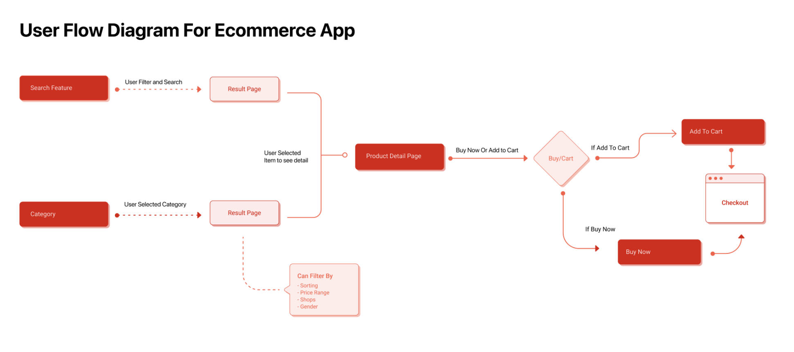


## System Architecture
### Frontend Architecture
The frontend of **Project 4** is built using only core web technologies: **HTML5**, **CSS3**, and **vanilla JavaScript**—with no external UI frameworks. All pages are rendered server-side using Django templates for fast initial loads and maintainability.

- **HTML**: Provides semantic structure for all pages, including the minimal homepage (hero image + navigation bar) and product/category views.  
- **CSS**: Handles styling and layout, including custom product cards, buttons, and form elements. Fully responsive across mobile, tablet, and desktop.  
- **JavaScript**: Used selectively for enhanced interactivity:
  - Initialising **Stripe Elements** on the checkout page  
  - Updating cart item counts dynamically  
  - Providing form validation feedback  

No client-side routing or complex frameworks are used. Most interactions trigger full page loads through standard HTML forms.

---

### Backend Architecture
The backend is built with **Python** and the **Django** web framework, following the **Model-View-Template (MVT)** design pattern.  

- **Models**: Define core data structures
  - `Product`: name, description, price, category, subcategory, image URL, rating  
  - `User`: Django’s built-in authentication system  
  - `Order`: stores completed purchases, linked to the user and Stripe payment ID  
- **Views**: Handle business logic via function-based views
  - Render homepage, category pages, and product details  
  - Process user registration/login via POST forms  
  - Manage cart state (via Django sessions for guests or user accounts)  
  - Initiate Stripe checkout and handle post-payment redirects  
- **URLs**: Clean, semantic, and user-friendly
  - `/` → homepage  
  - `/foods/frozen/` → frozen food listings  
  - `/checkout/` → payment page  
- **Security**:
  - CSRF protection on all forms  
  - Passwords hashed automatically using Django’s authentication system  
  - Sensitive keys (Stripe, Gmail API) stored securely in environment variables  
- **Database**: SQLite used for development; all schema defined via Django models  

---


### MVT Layer Mapping

| Layer      | Responsibility | Example |
|-----------|----------------|---------|
| **Model**     | Data structure | `Product`, `Order`, `User` |
| **View**      | Business logic | Category page rendering, Stripe checkout |
| **Template**  | Presentation   | Homepage, product detail pages, cart view |

---


### External Integrations
- **Stripe API**: Handles secure payments via PaymentIntent and webhooks  
- **Gmail API**: Sends automated order confirmation emails using OAuth 2.0 authentication  

---

### Tech Stack Summary

| Layer         | Technologies Used                  |
|---------------|-----------------------------------|
| Frontend      | HTML5, CSS3, vanilla JavaScript   |
| Backend       | Python, Django (MVT)              |
| Database      | SQLite (development)              |
| Payments      | Stripe API                        |
| Emails        | Gmail API with OAuth 2.0          |
| Hosting       | Heroku                             |

---


### Architecture Diagram
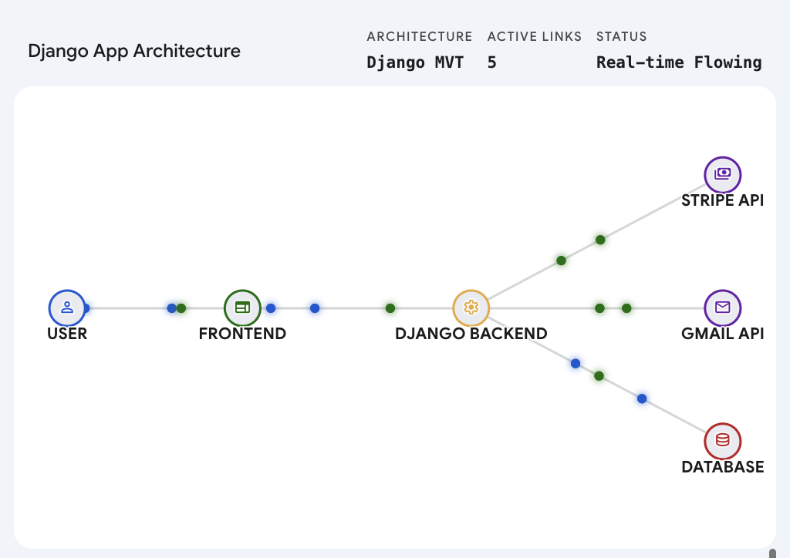  
*Placeholder diagram showing frontend, backend, database, and external integrations.*  

---


### Notes on Performance & Scalability
- Server-side rendering ensures fast initial page loads and simple caching.  
- The architecture can scale to PostgreSQL or another relational database for production.  
- Future improvements may include caching product queries, load balancing, or integrating a REST API for headless frontend usage.  


## API Design & Endpoints
**Project 4 does not expose a public REST API** for products, users, or cart management. Instead, it relies on **two external APIs** for essential functionality:


### 1. Stripe API
Handles secure payment processing:

| Endpoint                    | Method | Description |
|------------------------------|--------|-------------|
| `/create-checkout-session/`  | POST   | Creates a Stripe PaymentIntent via the Stripe Python SDK. Returns a session ID or `client_secret` to the frontend. |
| `/webhook/stripe/`           | POST   | Receives signed Stripe events (e.g., `payment_intent.succeeded`). Verifies the signature and updates order status. |

> All payment logic is server-side to prevent exposing sensitive keys or logic on the frontend.


### 2. Gmail API (via Google OAuth)
Sends automated order confirmation emails:

- Triggered after successful Stripe payments.
- Uses Gmail API with OAuth 2.0 to send formatted emails to customers.
- Avoids reliance on third-party email services and leverages Google’s secure infrastructure.

> No internal JSON APIs exist for product listing or cart updates—all content is rendered directly via **Django templates** for simplicity and security.

---


## Database Design
### Schema Overview
Project 4 uses a **relational database** managed through Django’s ORM (SQLite for development). The core tables are:

| Table                  | Purpose |
|------------------------|---------|
| `auth_user`            | Built-in Django user model for authentication |
| `products_product`     | Stores product details (name, category, subcategory, price, image URL, rating) |
| `orders_order`         | Stores completed orders linked to authenticated users and Stripe payment IDs |

> Cart data is session-based and transformed into an `Order` record upon successful payment. Guest users cannot create permanent orders.

---


### Models & Relationships
- **User ↔ Order**: One-to-many; each user may have multiple orders.  
- **Order ↔ Product**: Indirect many-to-many via session-based cart at checkout.  
- **Product**: Standalone reference table containing all food and drink items.  
- **Cart**: No separate model; stored in session until checkout, simplifying the database.

---


### Data Validation & Integrity
- Django model validators enforce:
  - Non-negative prices (`MinValueValidator`)  
  - Ratings restricted to 1–5 range  
  - Required fields (`name`, `price`) cannot be empty
- Stripe webhook safeguards:
  - Event signatures verified  
  - Duplicate orders prevented via `payment_intent_id` idempotency  
- Session data securely signed to prevent tampering.

---


### Schema Diagram
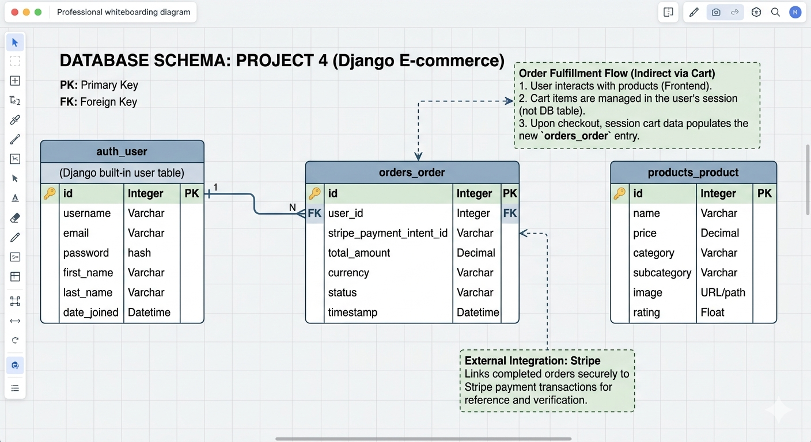  
*Visual representation of core tables, relationships, and associations in Project 4.*

---


### Notes
- The schema is **minimal and secure**, supporting all core functionality: browsing, filtering, authentication, cart persistence, and payments.  
- Future scalability: can accommodate reviews, inventory tracking, multiple payment providers, or migration to PostgreSQL/MySQL for production.


## Authentication & Authorisation
### User Registration & Logic
Project 4 implements user authentication using Django’s built-in `auth` system, providing **secure and standards-compliant registration and login functionality**.

- **Registration**: Users create an account by submitting a form with a username, email, and password.  
  - Passwords are **hashed automatically using PBKDF2** before storage.  
  - Sensitive credentials are **never saved in plain text**.  
- **Login**: Validates credentials against the database and establishes an authenticated session using Django’s session framework.  
- **Security Features**:  
  - CSRF protection is enabled on all forms.  
  - Error messages provide helpful, non-revealing feedback for failed attempts.  
  - Sessions expire after inactivity in line with Django defaults.  
- All authentication views are served via **server-rendered templates**; form submissions use standard POST requests.


### Permissions & Access Control
Project 4 uses a **role-based access model**:

- **Guest users**: Can browse products and add items to a session-based cart.  
- **Authenticated users**: Required to proceed to checkout and complete Stripe payments, ensuring each order is linked to a verified user account.  
- **Sensitive Views**: Checkout and order confirmation pages are protected with Django’s `@login_required` decorator.  
- **Session Management**: Session data is stored securely using signed cookies.  

> This approach balances usability with security, granting open browsing while restricting critical actions to verified users.

---


## Skeleton Plane (Wireframes)
### Wireframes Overview
Wireframes were developed early in the design process to map core user interactions and layout structure **before coding**. They follow a **mobile-first, low-fidelity approach**, prioritising clarity, hierarchy, and usability.

- **Homepage Wireframe**: Full-width hero image with a persistent top navigation bar. Minimal content to encourage exploration via category links.  
- **Product Listing Pages**: Responsive grid of product cards with **name, image, price, and rating**. Filtering options appear in the top navigation.  
- **Product Detail Page**: Larger image, detailed description, price, and “Add to Cart” button.  
- **Checkout Flow**: Cart summary followed by secure card input using **Stripe Elements**.

### Wireframe Images


> These low-fidelity blueprints guided development, ensuring HTML and Django templates aligned with intended navigation and user flows.

---


## Surface Plane (UI Design)
### Mobile-First Design
- Fully responsive across **mobile, tablet, and desktop**.  
- Interactive elements like filters and cart updates work seamlessly on small screens.  
- Wireframes informed final HTML and CSS layout structures.


### Colour Scheme
- **Primary palette**: White (#FFFFFF) and Black (#000000) for maximum contrast.  
- **Accent**: Vibrant yellow hero image on the homepage as a visual anchor.  
- Minimalist palette improves **readability, focus, and accessibility**. 


### Typography
- System fonts: `system-ui, -apple-system, BlinkMacSystemFont, 'Segoe UI', sans-serif`.  
- Clear hierarchy:  
  - Headings: 24–28px bold  
  - Product names: 18px bold  
  - Body text: 16px regular  
- No decorative fonts, italics, or unnecessary styles. Focused purely on **clarity and usability**.


### Imagery & Icons
- **Hero image**: Bright yellow, minimal graphics.  
- Product photography: Plain white background, consistent lighting.  
- No external icon libraries used; functional cues via **text labels or Unicode symbols**.  

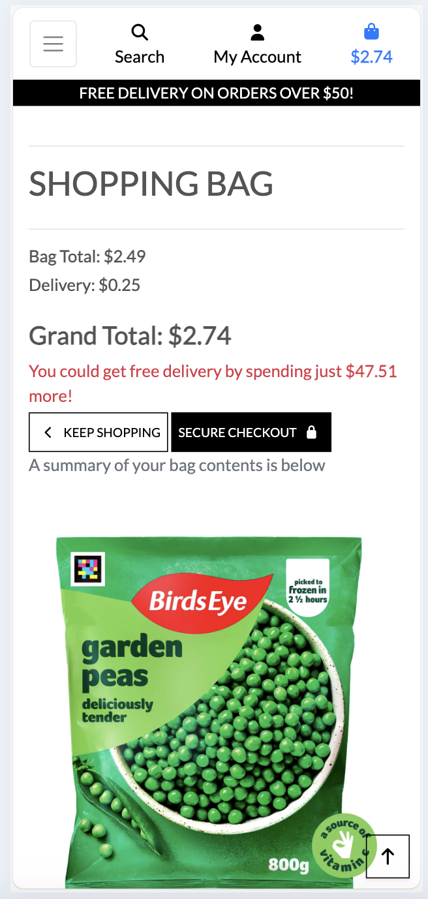

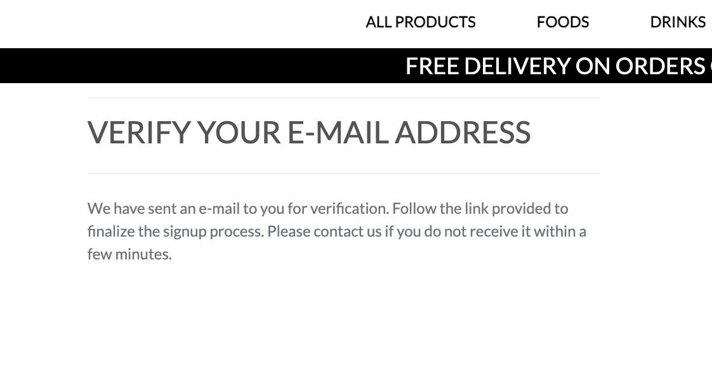
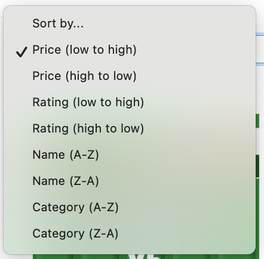
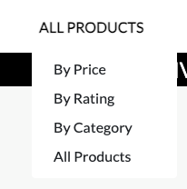

---


## Features
### User Dashboard
- No traditional dashboard implemented in this version.  
- After authentication, users proceed directly to checkout and receive an **order confirmation**.  
- Streamlined approach prioritises the **core shopping journey**.  
- Future iterations may include order history or saved preferences.


### Search & Filter
- **Category-driven filtering** via top navigation: Foods, Drinks, All Products, Special Offers.  
- Subcategory options appear on click or hover (e.g., Frozen, Meat & Poultry).  
- Sort products by **price (low to high)** or **customer rating**.  
- Server-side filtering ensures **fast and reliable results** without client-side complexity.  


### Error Handling & Feedback
- **Forms**: Inline error messages for missing fields or password mismatches.  
- **Checkout**: Failed or cancelled Stripe payments redirect users to the cart with **descriptive alerts**.  
- **Success messages**: Adding to cart or completing purchases triggers immediate feedback.  
- Edge cases handled gracefully (404 pages, unauthenticated access prompts).

> These measures ensure users always understand the system state and can recover from mistakes easily.


## Frontend Implementation
### Templates & Components
The frontend of Project 4 is built entirely using **Django’s templating system** with hand-written **HTML5 and CSS3**. There are no external UI libraries or component frameworks—every element is crafted from scratch to ensure full control and minimal overhead. A base template (`base.html`) defines the shared structure, including the persistent navigation bar and consistent page layout, which all other pages extend using Django’s `` and `` syntax. The homepage template renders only a full-width hero image and the navigation bar, reflecting the intentional minimalism of the landing experience. Product listing and detail pages dynamically inject content into this structure using context data passed from Django views, ensuring that category filters, product cards, and pricing are rendered server-side with no client-side data fetching. Each product card follows a uniform design—image, name, price, and rating—styled consistently through a single CSS file. This template-driven approach keeps the frontend simple, fast-loading, and tightly integrated with the backend logic.


### Client-Side Logic
Client-side interactivity is limited to essential enhancements using **vanilla JavaScript**, with no dependencies or build tools. A small script is included only on the checkout page to initialise **Stripe Elements**, securely loading Stripe’s JavaScript library from their official CDN and mounting the card input field. Elsewhere, JavaScript is used sparingly: a lightweight function toggles the mobile menu on smaller screens, and another updates the cart item count in the navigation bar when items are added (via DOM manipulation after form submission). Form validation for registration and login is handled primarily by Django server-side, but basic front-end checks (e.g., password length, required fields) provide immediate feedback without full page reloads. No AJAX calls are used for product browsing or cart updates—all interactions rely on standard HTML form submissions and full-page rendering, prioritising simplicity and reliability over dynamic behaviour. This restrained use of client-side logic ensures the site remains accessible, maintainable, and performant across all devices.


## Backend Implementation
### Views / Controllers
The backend of Project 4 is implemented using **Django’s function-based views**, which handle all routing and rendering logic in a clear and maintainable way. Each URL path maps directly to a view that processes the request, retrieves or manipulates data, and returns an appropriate HTTP response. The homepage view renders only the hero image and navigation bar, while category-specific views—such as `foods_view`, `drinks_view`, or `specials_view`—filter products by category and subcategory using simple ORM queries (e.g., `Product.objects.filter(category='Foods', subcategory='Frozen')`). The product detail view fetches a single item by ID, and the checkout view handles both cart display and Stripe session creation. Authentication views leverage Django’s built-in `LoginView` and custom registration logic, ensuring secure user handling without reinventing core functionality. All views pass contextual data to templates using standard Python dictionaries, keeping the separation between logic and presentation clean and readable.


### Business Logic
Core business logic is embedded within views and model methods, following Django best practices for simplicity and testability. Cart management is handled through **Django sessions**: when a user adds an item, the product ID and quantity are stored in the session dictionary, and this data persists across page loads until checkout. During checkout, the system validates that the cart is not empty and that the user is authenticated before proceeding. The Stripe integration is managed entirely server-side: the `/create-checkout-session/` view uses the Stripe Python SDK to create a `PaymentIntent` with the correct amount and currency, then returns the client secret to the frontend for confirmation. After payment, the Stripe webhook endpoint verifies the event signature and, upon receiving a `payment_intent.succeeded` event, creates a permanent `Order` record linked to the user and payment intent ID. This ensures that orders are only recorded for genuine, verified transactions. No complex workflows or external services are used—business rules remain focused, auditable, and tightly coupled to the actual user journey.


## Testing
A comprehensive testing strategy was applied throughout the development of Project 4 to ensure reliability, usability, and correctness. Full details of all test activities—including manual test cases, automated unit/integration tests, and front-end validation checks—are documented in a dedicated file:

➡️ **[View full testing report](TESTING.md)**

This includes:
- **Manual Testing**: Step-by-step user journey validation (e.g., browsing categories, adding to cart, completing Stripe checkout)
- **Automated Testing**: Django unit tests for models, views, and Stripe webhook logic
- **Validation Testing**: HTML/CSS validation, form error handling, and accessibility checks

The `testing.md` file serves as the complete audit trail for quality assurance in this project.


## Security, Deployment & Technology
### Security Considerations
#### Data Protection
Project 4 follows core web security best practices to protect user data and maintain system integrity:

- **Password Security**: All user passwords are hashed using Django’s PBKDF2 algorithm—never stored in plain text.
- **CSRF Protection**: All sensitive operations (login, registration) are protected via Django’s built-in CSRF middleware.
- **Session Security**: Guest cart data is stored in signed cookies, preventing client-side tampering.
- **PCI Compliance**: Stripe Elements handles all card input; no payment data is stored on the server or in the database.
- **Webhook Verification**: Stripe webhook events are verified using `stripe.Webhook.construct_event()` to prevent fraudulent order creation.
- **Input Validation**: All forms include server-side validation; front-end checks provide instant feedback on invalid inputs.


#### Environment Variables
All sensitive configuration data is kept outside the codebase and loaded at runtime using `os.getenv()` or optionally `python-decouple`:

- Django `SECRET_KEY` and `DEBUG`
- Database credentials (for production)
- Stripe API keys (`STRIPE_PUBLIC_KEY`, `STRIPE_SECRET_KEY`)
- Gmail API OAuth credentials

A `.env.example` file documents required variables without exposing actual secrets.

---


### Accessibility
Project 4 follows basic web accessibility standards:

- Semantic HTML5 structure (`<h1>`, `<h2>`, `<nav>`, `<main>`, `<section>`)
- Keyboard-navigable elements with visible focus states
- Explicit `<label>` associations for form fields
- Descriptive `alt` attributes for images; decorative images use `alt=""`
- High-contrast black-on-white colour scheme for readability and WCAG AA compliance
- Foundations support screen readers and assistive technologies

---


### Deployment & Local Development
#### Deployment
Project 4 can be deployed to any platform supporting Python/Django (e.g., **Render**, **Railway**, **Heroku**):

- **Database**: SQLite for development; easily switchable to PostgreSQL for production.
- **Static Files**: Served via Django during development; configurable for CDN/cloud storage in production.
- **Dependencies**: Listed in `requirements.txt` for one-command installation.
- **Environment Variables**: Used for all sensitive keys, never exposed in code.
- Deployment-ready conventions applied (proper `.gitignore`, environment separation).


#### Deployment Diagram

*Illustrates local development, environment variables, staging/production, and external integrations (Stripe, Gmail API).*


#### Local Development Setup
To run Project 4 locally:

1. Fork the repository on GitHub or clone directly:
   ```bash
   git clone https://github.com/your-username/project_four_2025.git
   cd project_four_2025

2. Create and activate a virtual environment:
   python -m venv venv
   source venv/bin/activate   # macOS/Linux

3. Install dependencies:
   pip install -r requirements.txt

4. Apply migrations:
   python manage.py migrate

5. Run the development server:
python manage.py runserver

6. Access the project at http://127.0.0.1:8000/.
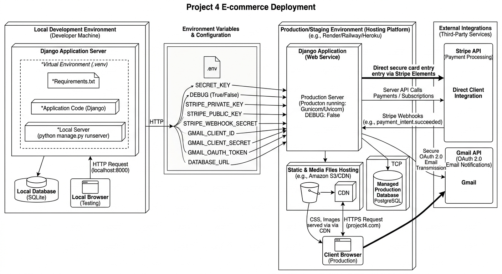


## Technologies Used
### Languages
- **Python**: Backend logic and Django framework  
- **HTML5**: Semantic document structure  
- **CSS3**: Styling and responsive layouts  
- **Vanilla JavaScript**: Minimal client-side interactivity (mobile menu toggle, cart updates, Stripe Elements)  


### Frameworks & Libraries
- **Django 5.x**: Backend, ORM, templating, authentication, security  
- **Stripe Python SDK + Stripe.js (v3)**: Payment processing  
- **Python-Decouple (optional)**: Environment variable management  
- No frontend frameworks (React/Vue) or UI libraries (Bootstrap/Tailwind) used  


### Tools & Services
- **Visual Studio Code**: Development  
- **Git & GitHub**: Version control  
- **SQLite**: Local development database  
- **Stripe API**: Payment processing  
- **Gmail API (OAuth 2.0)**: Order confirmation emails  

---


## Future Enhancements
- **User Dashboard**: View order history, save favourites, manage accounts  
- **Global Search Bar**: Keyword search across products  
- **Persistent Guest Cart**: Local storage or database-backed sessions  
- **Inventory Tracking**: Real-time stock levels  
- **User Reviews & Ratings**: Collect feedback and display ratings  
- **Enhanced Admin Interface**: Allow non-technical staff to manage products  
- **Production Database**: Migrate to PostgreSQL  
- **Automated Testing & CI/CD**: Expand coverage, automate deployment  

> All enhancements will maintain the minimalist, user-focused architecture.  

---


## Credits & Acknowledgments
Project 4 was developed independently as part of a full-stack web development assignment. Special thanks to:

- **Django & Python**: Robust, secure frameworks  
- **Stripe**: PCI-compliant payment infrastructure  
- **Visual Studio Code**: Development environment  
- **Google & Gmail API**: Secure email automation  
- **Spencer** – Code Institute Mentor  
- **Ax de Klerk, Jordan Acomba & Steve Powell** – Fellow Code Institute cohort members  
- **Code Institute Slack channel Peer Code Review** – For reviewing the site and providing feedback  

- Product images are placeholders or royalty-free sources  

This project reflects a personal implementation with **emphasis on usability, security, and maintainable full-stack architecture**.