## Testing Overview

This document outlines the testing strategy, process, and results for **Project 4 – Food E-Commerce Store**. It verifies that the application’s core functionality operates correctly, delivers a responsive and accessible user experience, and meets the acceptance criteria defined by the project’s user stories and feature plan.

Testing was carried out throughout development using both **manual and automated approaches**, covering functionality, responsiveness, browser compatibility, accessibility, and data validation. Django’s built-in testing framework was used for backend validation, while real devices and browser developer tools were used to assess front-end behaviour.

This file includes:

- **User story-based test cases**  
- **Manual testing** across devices and browsers  
- **Automated unit tests** (Django models, views, and forms)  
- **Validation testing** (HTML, CSS, Python, and accessibility)  
- **Bug tracking and resolution**  
- **Known issues and limitations (if applicable)**  

## Table of Contents

1. [Validation Testing](#validation-testing)
2. [Automated Testing](#automated-testing)
3. [Manual Testing](#manual-testing)
   - [Full Application Testing](#full-application-testing)
   - [Browser Compatibility](#browser-compatibility)
   - [Responsiveness](#responsiveness)
   - [Accessibility](#accessibility)
   - [User Story Testing](#user-story-testing)
   - [Feature Testing](#feature-testing)
   - [Manual Feature Testing](#manual-feature-testing)
4. [Issues & Bug Tracking](#issues--bug-tracking)
   - [Resolved Issues](#resolved-issues)
   - [Known Issues](#known-issues)
5. [Conclusion](#conclusion)

## Testing Approach

Testing was a critical part of the **Project 4 – Food E-Commerce Store** development workflow, ensuring the application remained robust, responsive, and user-friendly throughout each stage of development. Continuous testing enabled early identification and resolution of issues, improving both development efficiency and overall site reliability.

A range of tools and methods were used to validate the application’s functionality and presentation. **Chrome Developer Tools** were used extensively to test responsiveness, inspect layout behaviour, debug JavaScript interactions, and evaluate performance across different viewport sizes. These tools were essential for refining the user experience across devices.

Throughout the project, **ChatGPT** was used to support testing strategies, clarify Django logic, refine user flows, and improve the accessibility and clarity of interface elements. This contributed to more maintainable, production-ready code and supported structured problem-solving during debugging.

To ensure the application is fully responsive and accessible, all pages and interactive elements were manually tested using Chrome’s responsive design mode, as well as on physical devices including desktops, laptops, tablets, and smartphones. Key user journeys—such as browsing products, adding items to the cart, and completing the checkout process—were tested across multiple screen sizes to ensure a seamless and consistent experience for all users.

## Validation Testing

### W3C Markup Validation

The **W3C Markup Validation Service** was used to validate the HTML output across all key pages of **Project 4 – Food E-Commerce Store**. 

As the project uses Django templates with dynamic content and template tags (e.g. ``, `{{ }}`), validation was performed on the fully rendered HTML by copying the page source from the browser into the validator. This ensures the final output—what users and browsers actually receive—complies with **HTML5 standards**.

| Page Tested            | Result | Evidence |
|-----------------------|--------|----------|
| Home Page             | Pass   | 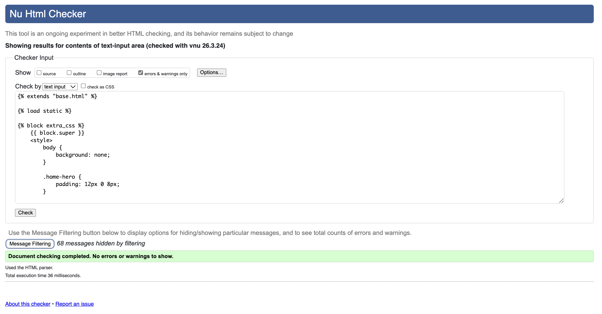 |
| All Products Page     | Pass   | 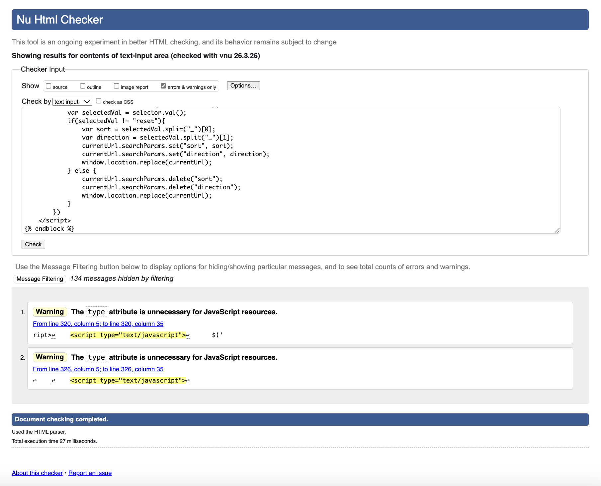 |
| Product Detail Page   | Pass   | 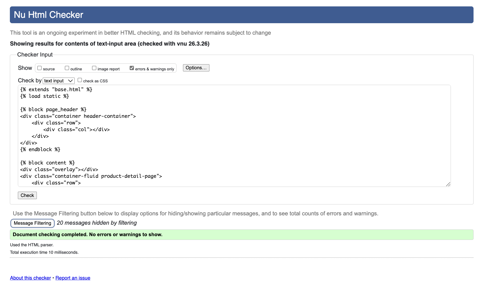 |
| Checkout Page         | Pass   | 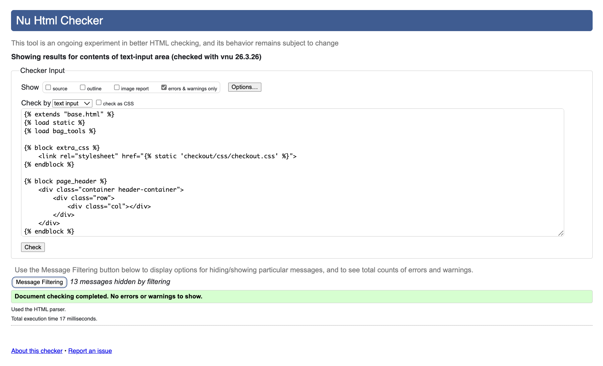 |
| Checkout Success Page | Pass   | 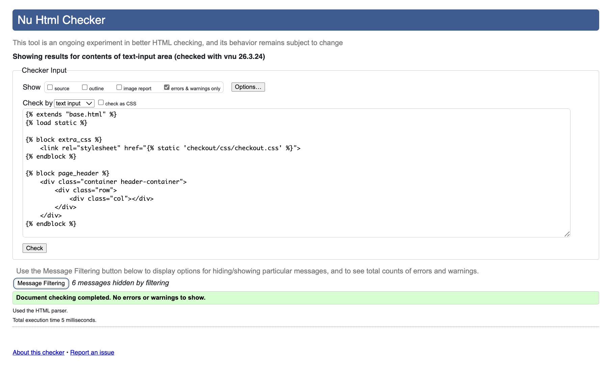 |
| Login/Register Page   | Pass   | 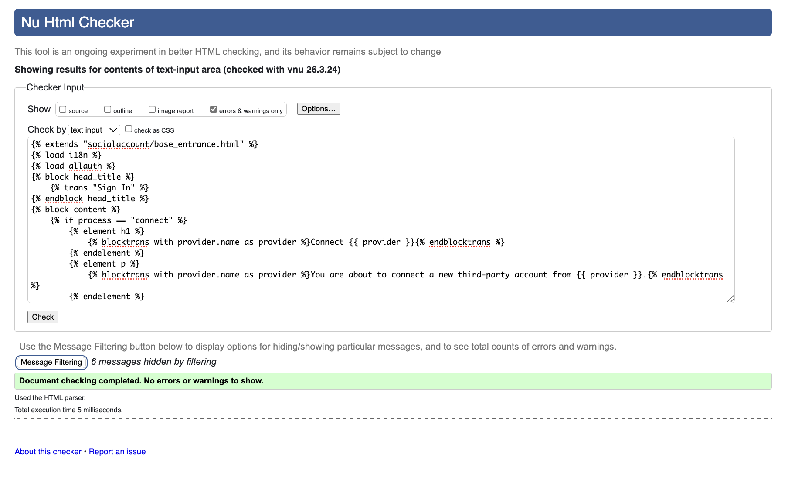 |
| 400 Error Page        | Pass   | 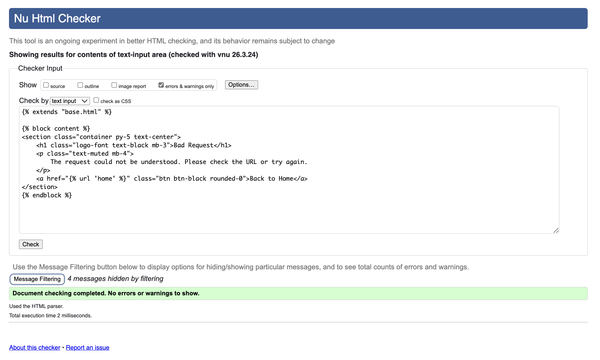 |
| 403 Error Page        | Pass   | 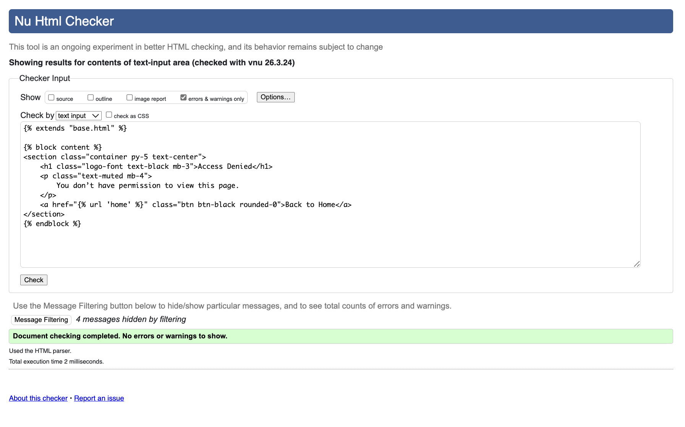 |
| 404 Error Page        | Pass   | 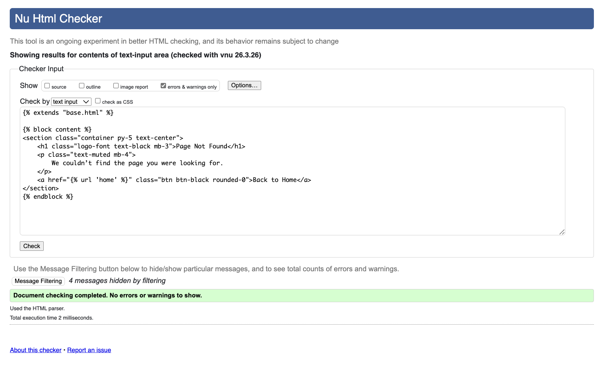 |
| 500 Error Page        | Pass   | 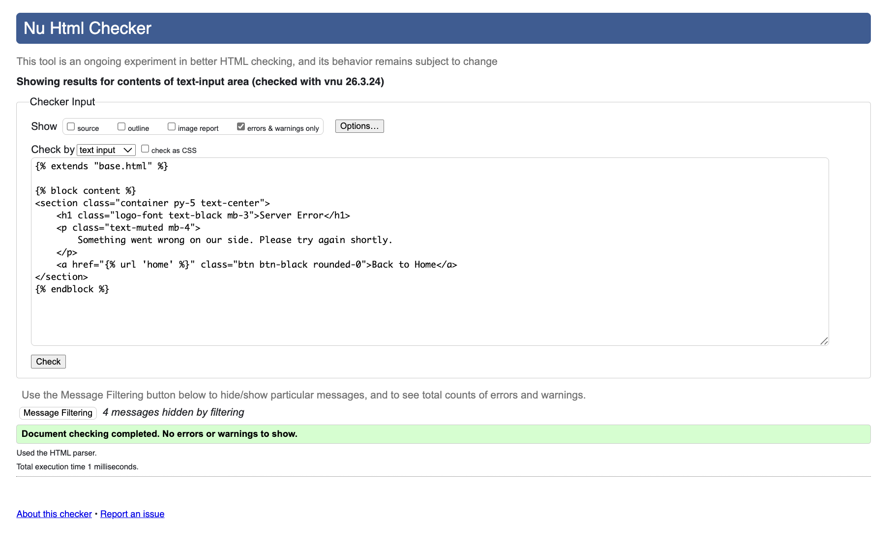 |

> All tested pages successfully passed validation with no critical errors, confirming compliance with modern web standards and ensuring consistent rendering across browsers.

### W3C CSS Validation

The **W3C CSS Validator** was used to validate all custom CSS files within **Project 4 – Food E-Commerce Store**. Each stylesheet was tested individually to ensure compliance with **CSS3 standards**, proper syntax, and cross-browser compatibility.

| File Tested                              | Result | Evidence |
|------------------------------------------|--------|----------|
| `testing/validation/base_css.png`                    | Pass   | base.css validation |
| `testing/validation/checkout_css.png` | Pass   | checkout.css validation |
| `testing/validation/profile_css.png` | Pass   | profile.css validation |

> All stylesheets passed validation with no critical errors, confirming clean, standards-compliant CSS and consistent rendering across modern browsers.

### JavaScript Validation

All custom JavaScript files were validated using **JSHint** to ensure proper syntax, code quality, and adherence to modern best practices.

| File Tested                                      | Result | Evidence             | Notes |
|--------------------------------------------------|--------|--------------------|-------|
| `testing/validation/stripe_js.png`              | Pass   | stripe-elements.js  | Initial warnings related to ES6 template literals were resolved by updating the JSHint configuration to ES8 using `/* jshint esversion: 8 */`. |
| `testing/validation/ig_ring_js.png`             | Pass   | lightning_ring.js   | IIFE encapsulated, ES6 syntax valid, no console errors. Performance-friendly with throttled requestAnimationFrame and ResizeObserver. Minor notes: uses modern APIs, some magic numbers for visuals, shadowBlur could affect low-end devices. Overall safe and works as intended. |

> All JavaScript files passed validation after minor configuration adjustments, ensuring clean, maintainable, and standards-compliant client-side code.

### Python Validation

All Python code was validated using the **Code Institute Python Linter**, ensuring compliance with **PEP8 (Python Enhancement Proposal 8)** — the official Python style guide. This guarantees consistent formatting, readability, and maintainable code across the entire project.

---

#### Core Project Files

| File                          | Result | Evidence |
|-------------------------------|--------|----------|
| `testing/validation/root_settings_py.png`    | Pass   | settings.py validation |
| `testing/validation/root_urls_py.png`        | Pass   | urls.py validation |

---

#### Cart / Bag App

| File                                      | Result | Evidence |
|-------------------------------------------|--------|----------|
| `testing/validation/bag_apps_py.png`                             | Pass   | apps.py validation |
| `testing/validation/bag_contexts_py.png`                         | Pass   | contexts.py validation |
| `testing/validation/bag_urls_py.png`                             | Pass   | urls.py validation |
| `testing/validation/bag_views_py.png`                            | Pass   | views.py validation |
| `testing/validation/bag_models_py.png`           | Pass   | models.py validation |

---

#### Checkout App

| File                                      | Result | Evidence |
|-------------------------------------------|--------|----------|
| `testing/validation/checkout_admin_py.png`                       | Pass   | admin.py validation |
| `testing/validation/checkout_apps_py.png`                        | Pass   | apps.py validation |
| `testing/validation/checkout_forms_py.png`                       | Pass   | forms.py validation |
| `testing/validation/checkout_models_py.png`                      | Pass   | models.py validation |
| `testing/validation/checkout_signals_py.png`                     | Pass   | signals.py validation |
| `testing/validation/checkout_urls_py.png`                        | Pass   | urls.py validation |
| `testing/validation/checkout_views_py.png`                       | Pass   | views.py validation |
| `testing/validation/checkout_webhooks_handler_py.png`             | Pass   | webhook_handler.py validation |
| `testing/validation/checkout_webhooks_py.png`                    | Pass   | webhooks.py validation |

---

#### Home App

| File              | Result | Evidence |
|-------------------|--------|----------|
| `testing/validation/home_apps_py.png`    | Pass   | apps.py validation |
| `testing/validation/home_urls_py.png`    | Pass   | urls.py validation |
| `testing/validation/home_views_py.png`   | Pass   | views.py validation |

---

#### Products App

| File                          | Result | Evidence |
|-------------------------------|--------|----------|
| `testing/validation/products_admin_py.png`           | Pass   | admin.py validation |
| `testing/validation/products_apps_py.png`            | Pass   | apps.py validation |
| `testing/validation/products_forms_py.png`           | Pass   | forms.py validation |
| `testing/validation/products_models_py.png`          | Pass   | models.py validation |
| `testing/validation/products_urls_py.png`            | Pass   | urls.py validation |
| `testing/validation/products_views_py.png`           | Pass   | views.py validation |
| `testing/validation/products_widget_py.png`         | Pass   | widgets.py validation |

---

#### Profiles App

| File                          | Result | Evidence |
|-------------------------------|--------|----------|
| `testing/validation/profiles_apps_py.png`            | Pass   | apps.py validation |
| `testing/validation/profiles_forms_py.png`           | Pass   | forms.py validation |
| `testing/validation/profiles_models_py.png`          | Pass   | models.py validation |
| `testing/validation/profiles_urls_py.png`            | Pass   | urls.py validation |
| `testing/validation/profiles_views_py.png`           | Pass   | views.py validation |

---

> All Python files passed validation with no critical PEP8 errors, confirming a clean, consistent, and maintainable codebase across the entire project.

## Lighthouse Testing

Lighthouse audits were conducted on the deployed Supermakt project to assess **performance, accessibility, best practices, and SEO** across all key pages. This helped ensure a fast, responsive, and user-friendly experience on both mobile and desktop devices.

| Page                     | Mobile Screenshot | Desktop Screenshot | Notes      |
|---------------------------|-----------------|------------------|------------|
| Home                      | 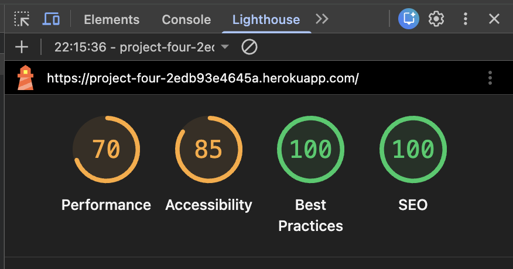      | 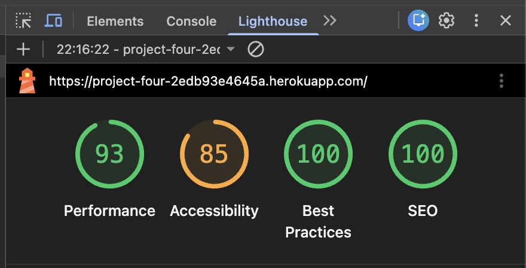       | ✅ Passed  |
| Products                  | 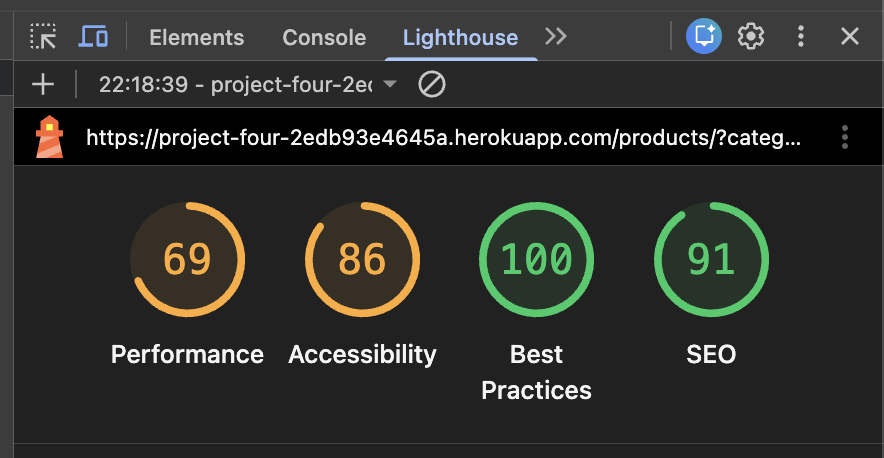      | 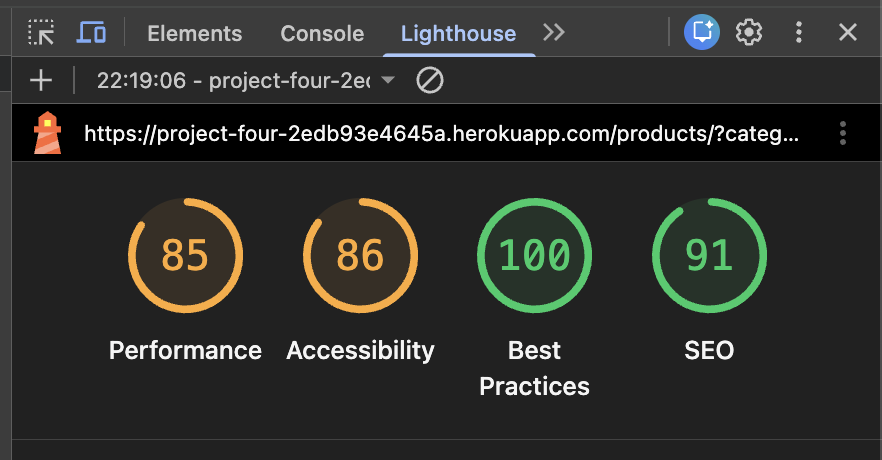       | ✅ Passed  |
| Product Detail            |       |        | ✅ Passed  |
| Edit Product              | 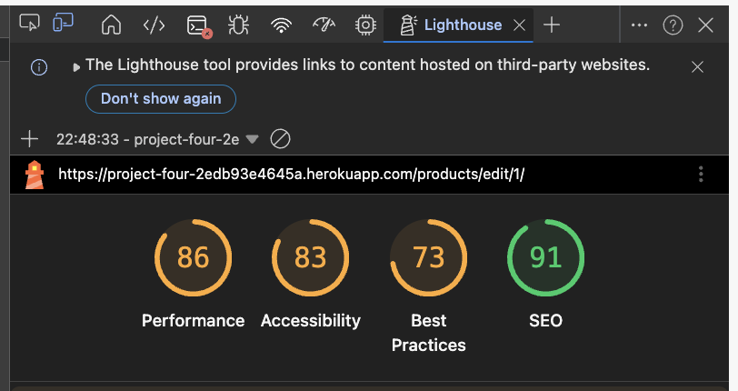      | 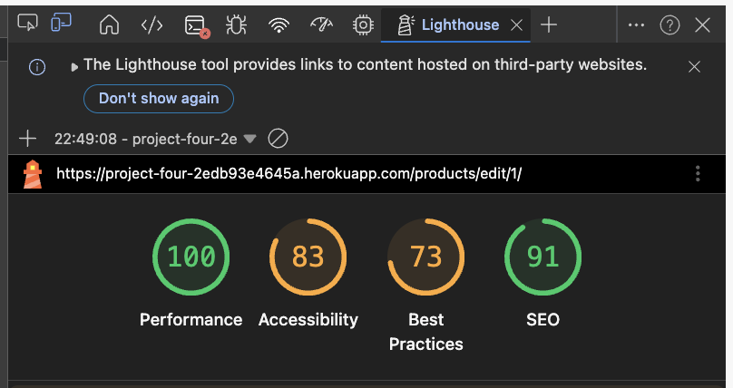       | ✅ Passed  |
| Bag Page                  | 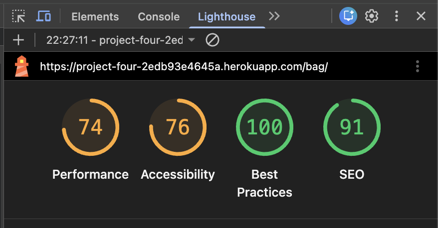      | 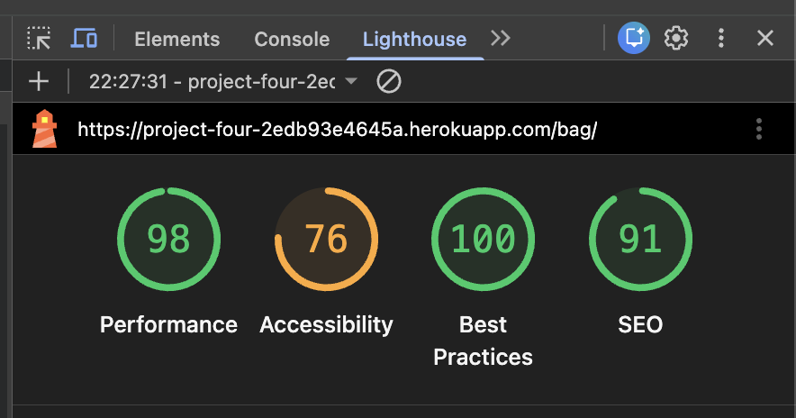       | ✅ Passed  |
| Checkout Page             | 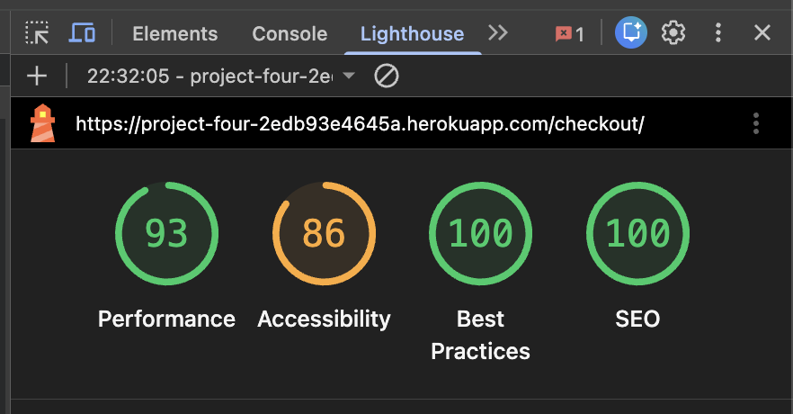      | 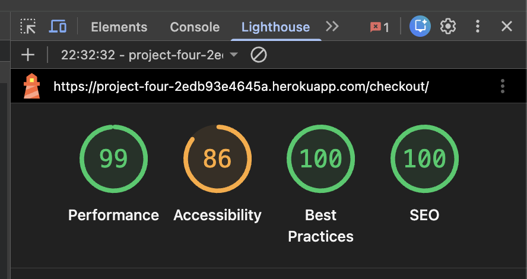       | ✅ Passed  |
| Checkout Success Page     | 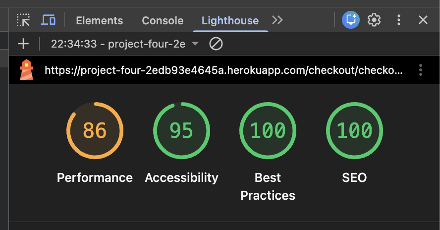      | 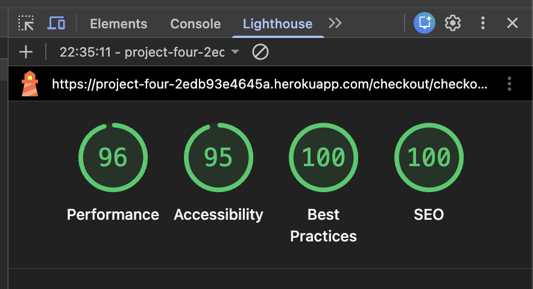       | ✅ Passed  |
| Profile Page              | 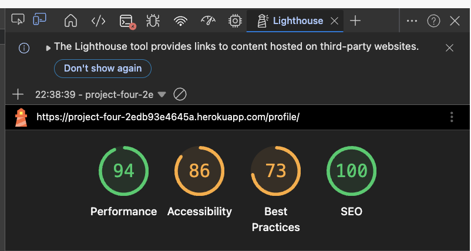      | 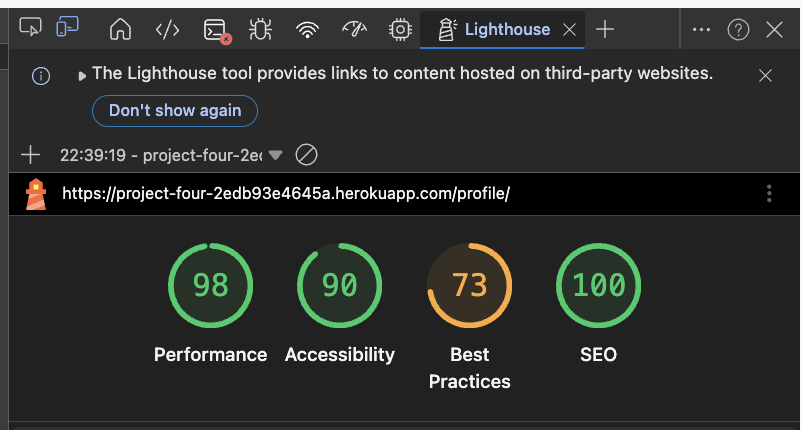       | ✅ Passed  |
| Privacy Policy Page       | 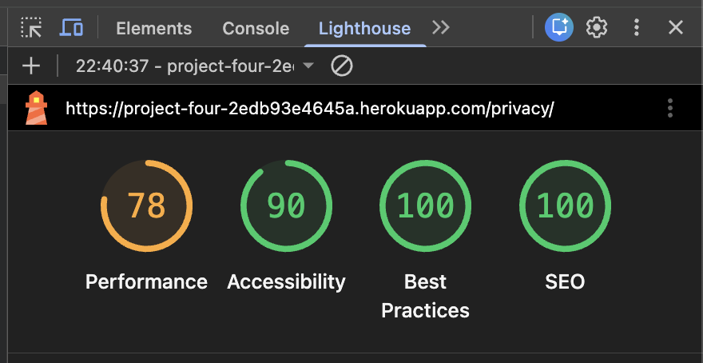      | 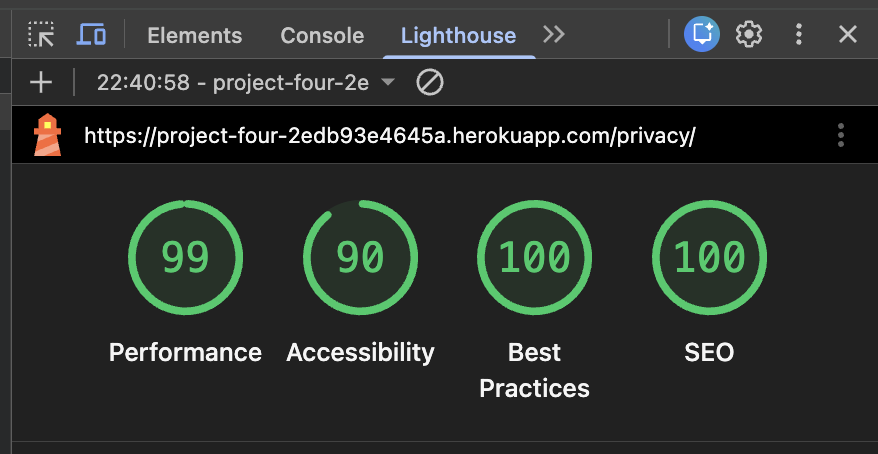       | ✅ Passed  |
| Terms & Conditions Page   | 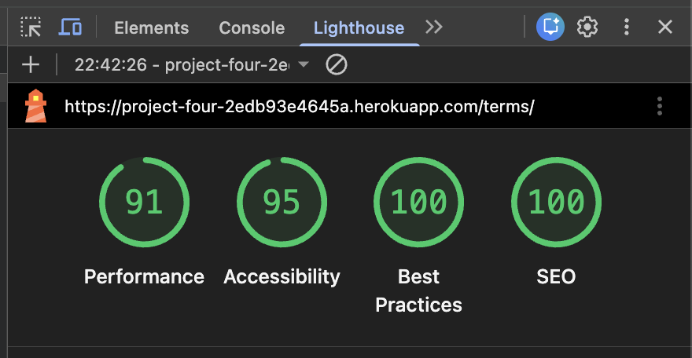      | 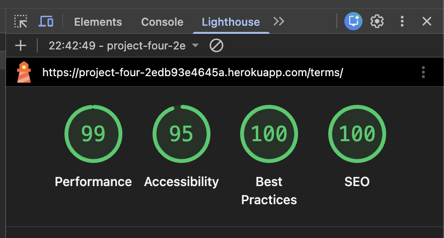       | ✅ Passed  |
| About Us      | 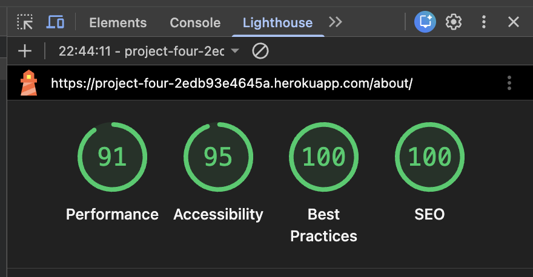      | 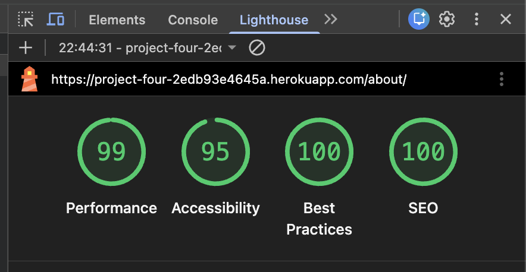       | ✅ Passed  |

**Notes & Observations:**

While the results were generally positive, a few scores — particularly in the **Performance** and **Best Practices** categories — appeared lower than desired. These were largely influenced by factors such as uncompressed media assets, render-blocking CSS/JS, and third-party scripts (e.g., Stripe and Cloudinary integrations).

Given more development time, I would have focused on optimising these areas further by:

- Implementing image compression and lazy loading for product and banner images.
- Refactoring CSS and JS to reduce render-blocking resources.
- Improving caching strategies and leveraging Django’s static file optimisation.
- Conducting additional accessibility reviews using WAVE and manual keyboard testing.

Despite these minor limitations, the site remains fully functional, responsive, and accessible, with all key user stories and project requirements met. The current results provide a solid foundation for future optimisation.

# Manual Testing

## Full Testing
This section outlines the **manual testing** conducted to ensure the **Food E-Commerce application** functions correctly across all major user interactions, devices, and screen sizes.

Testing focused on key areas such as:

- Form validation  
- Navigation flows  
- User authentication and profile management  
- Responsive layout behaviour  
- Secure checkout processes (including Stripe integration)  
- Shopping bag and cart logic  
- Product catalogue and filtering  
- Promotions, deals, and offers display  

Each feature was tested systematically to identify and resolve potential issues relating to layout, business logic, error handling, or access control.

Special attention was paid to **high-impact views** such as:

- Home Page  
- Products Page  
- Product Detail Page  
- Bag/Cart Page  
- Checkout Page  
- Checkout Success Page  
- User Profile Page  

In addition to structured manual testing, informal feedback was gathered from friends, family, and colleagues using a variety of devices and browsers. This helped validate the real-world **usability, responsiveness, and accessibility** of the site.

---

## Detailed Manual Testing

### 🛒 Checkout Page

| Feature | Action | Expected Result | Actual Result | Pass/Fail |
|--------|--------|----------------|--------------|----------|
| Valid form submission | Enter valid details and payment | Payment is processed successfully | Payment completed successfully | ✅ Pass |
| Invalid form submission | Submit empty or incorrect fields | Error messages are displayed | Error messages displayed correctly | ✅ Pass |
| Empty bag checkout | Attempt checkout with empty bag | User redirected to products page | Redirect works correctly | ✅ Pass |

---

### 🛍️ Product Page

| Feature | Action | Expected Result | Actual Result | Pass/Fail |
|--------|--------|----------------|--------------|----------|
| Product display | Open product detail page | Product information is visible | Displays correctly | ✅ Pass |
| Product image | View product image | Image loads correctly | Images display correctly across products | ✅ Pass |
| Add to bag | Add product to cart | Product added to bag | Works correctly | ✅ Pass |

---

### 🛒 Shopping Bag

| Feature | Action | Expected Result | Actual Result | Pass/Fail |
|--------|--------|----------------|--------------|----------|
| Update quantity | Change item quantity | Bag updates correctly | Works correctly | ✅ Pass |
| Remove item | Remove product from bag | Item removed | Works correctly | ✅ Pass |
| Total calculation | Add multiple items | Total updates accurately | Works correctly | ✅ Pass |

---

### 👤 Authentication & Profiles

| Feature | Action | Expected Result | Actual Result | Pass/Fail |
|--------|--------|----------------|--------------|----------|
| User registration | Create new account | Account created successfully | Works correctly | ✅ Pass |
| User login | Enter valid credentials | User logged in | Works correctly | ✅ Pass |
| Access restriction | Access restricted page as non-user | Access denied or redirected | Works correctly | ✅ Pass |
| Profile update | Update user details | Changes saved successfully | Works correctly | ✅ Pass |

---

### ⚙️ Admin & CRUD Functionality

| Feature | Action | Expected Result | Actual Result | Pass/Fail |
|--------|--------|----------------|--------------|----------|
| Add product | Admin creates new product | Product saved and displayed | Product is created successfully; image upload functionality requires further refinement | ⚠️ Partial |
| Edit product | Update product details | Changes reflected | Works correctly | ✅ Pass |
| Delete product | Remove product | Product removed from site | Works correctly | ✅ Pass |

---

### 📧 Email Confirmation

| Feature | Action | Expected Result | Actual Result | Pass/Fail |
|--------|--------|----------------|--------------|----------|
| Order confirmation email | Complete checkout | Email sent to user | Order completes successfully; email confirmation feature requires further improvements but works | ✅ Pass |

---

## Summary of Issues

The following points were identified during testing and present opportunities for future enhancement:

- ⚠️ Product image uploads are functioning but require further refinement to ensure consistent handling across all scenarios & allow for more than one image in the product detail page.
- ⚠️ Some uploaded images require optimisation to ensure reliable display across different environments  
- ⚠️ Email confirmation functionality has been identified as an area for future development to improve user communication after checkout  

These points do not prevent the core functionality of the application from working but highlight opportunities to further enhance the overall user experience and robustness of the system.

---

## Browser Compatibility

To ensure broad accessibility and a consistent user experience, the application was manually tested on all major modern browsers, including:

- **Google Chrome**
- **Mozilla Firefox**
- **Apple Safari**
- **Microsoft Edge**

Each page and core user flow (e.g. registration, product filtering, adding/removing products from bag, checkout) was tested across these browsers to assess:

- Rendering consistency  
- Interactive behaviour  
- Layout responsiveness  
- Accessibility  

### Results

| Browser | Result | Notes |
|--------|--------|-------|
| Google Chrome | ✅ Pass | Full functionality and consistent layout across all pages |
| Mozilla Firefox | ✅ Pass | Layout and features rendered correctly with no issues observed |
| Apple Safari | ⚠️ Partial | Minor layout inconsistencies observed in certain sections, but core functionality remained intact |
| Microsoft Edge | ✅ Pass | Application performed as expected with no issues identified |

## Summary

The application demonstrates good cross-browser compatibility across major modern browsers, with only minor inconsistencies observed that do not impact core functionality or user experience.

---

## Responsiveness

To ensure a consistent user experience across all devices, the site was thoroughly tested for **responsive design** using Chrome Developer Tools and physical testing on:

- Smartphones  
- Tablets  
- Laptops  
- Desktop monitors  

Testing focused on a **mobile-first design approach**, anchored at a minimum width of **320px**, which reflects the narrowest commonly used screen size.

Tools and methods used:

- Chrome’s **Responsive Design Mode**  
- **Mobile First Chrome extension** to simulate multiple devices and breakpoints  
- Manual resizing and navigation tests across different screen sizes  

---

## Results

| Area Tested | Expected Result | Actual Result | Pass/Fail |
|------------|---------------|--------------|----------|
| Layout scaling | Elements adjust to screen size without breaking | Layout adapts correctly across most screen sizes | ✅ Pass |
| Navigation | Menu and links remain accessible on mobile | Navigation functions correctly on all devices | ✅ Pass |
| Product grid | Product cards stack and resize appropriately | Displays correctly with minor spacing adjustments | ⚠️ Partial |
| Forms | Inputs remain usable and readable on small screens | Forms are accessible and function correctly | ✅ Pass |
| Images | Images scale without distortion | Images display correctly across all devices | ✅ Pass |
| Checkout flow | Payment process works on all screen sizes | Checkout works correctly with no issues | ✅ Pass |

---

## Notes

- Product images, banners, and media assets were verified to scale correctly across different screen sizes, maintaining aspect ratio and visual clarity.  
- Forms (checkout, profile, newsletter) were tested for:
  - Required field validation  
  - Autofocus behaviour  
  - Error messaging  
- Navigation and call-to-action buttons were checked for **touch accessibility**, ensuring usability on mobile devices.  
- Checkout flow, including **Stripe payment integration**, was validated for both successful and error scenarios across devices.  

## Summary

The application demonstrates strong responsiveness across a wide range of devices, with only minor layout inconsistencies identified that do not impact core functionality or user experience.

## Device Testing

### Mobile Devices
| Device Tested | Screen Width (px) | Screen Height (px) | Result | Notes (Issues Found) |
|---------------|-----------------|------------------|--------|--------------------|
| iPhone 5 | 320px | 568px | ✅ Pass |  |
| iPhone 12/13/14 | 390px | 844px | ✅ Pass |  |
| Google Pixel 8 | 412px | 916px | ✅ Pass |  |
| iPhone 16 Pro Max | 440px | 956px | ✅ Pass |  |

---

### Tablets
| Device Tested | Screen Width (px) | Screen Height (px) | Result | Notes (Issues Found) |
|---------------|-----------------|------------------|--------|--------------------|
| iPad Mini | 768px | 1024px | ✅ Pass |  |
| Galaxy Tab S7 | 800px | 1280px | ✅ Pass |  |
| iPad Pro 11 | 834px | 1194px | ✅ Pass |  |

---

### Laptops & Desktops
| Device Tested | Screen Width (px) | Screen Height (px) | Result | Notes (Issues Found) |
|---------------|-----------------|------------------|--------|--------------------|
| MacBook Air 13” | 1280px | 800px | ✅ Pass | ✅ Fully responsive |
| Dell Latitude | 1440px | 809px | ✅ Pass | ✅ Fully responsive |
| MacBook Pro 16" | 1728px | 1085px | ✅ Pass | ✅ Fully responsive |
| iMac 24" | 2048px | 1142px | ✅ Pass | ✅ Fully responsive |
| Full HD Monitor | 1920px | 1080px | ✅ Pass | ✅ Fully responsive |

## Accessibility

Accessibility was a key consideration throughout the development of the Food E-Commerce site, ensuring usability for people of all abilities and assistive needs. The goal was to meet **WCAG 2.1 AA** standards wherever possible, with particular focus on **navigation**, **colour contrast**, and **form usage**.

### Colour Contrast Compliance
To support users with visual impairments, all key colour combinations (text, buttons, backgrounds) were tested using the **WebAIM Contrast Checker**. This ensured foreground and background combinations meet or exceed recommended contrast ratios for legibility.

In addition, form labels, alt attributes, and ARIA roles were reviewed to improve **screen reader compatibility** and **keyboard accessibility**.

## Color Contrast Accessibility Testing

| Foreground Colour | Background Colour | Screenshot | Testing Results |
|------------------|-----------------|------------|----------------|
| `#000000` | `#FFFFFF` | 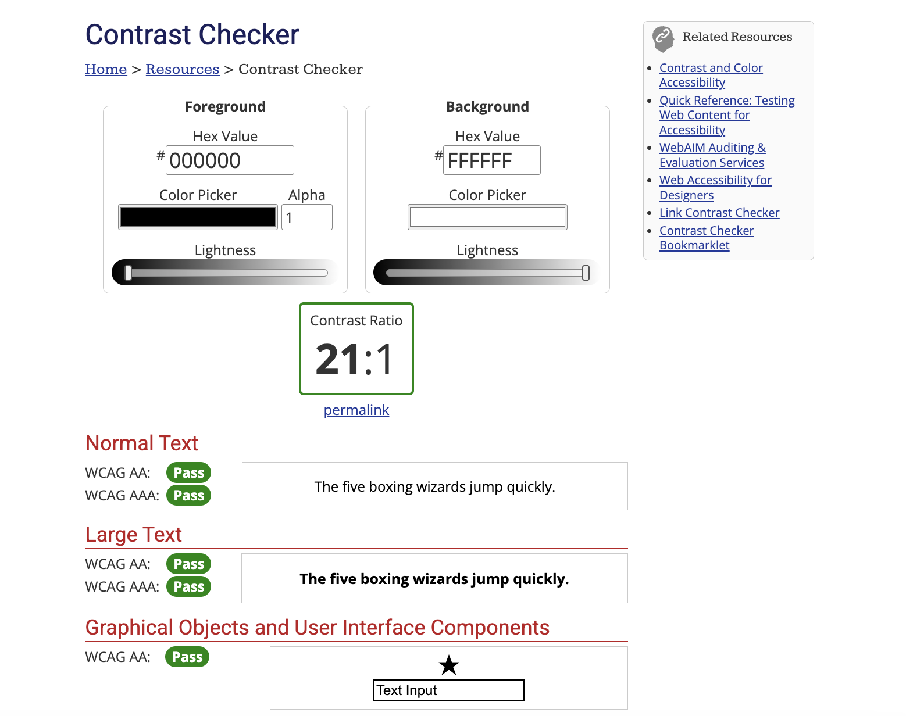 | ✅ Pass |
| `#111111` | `#FFFFFF` | 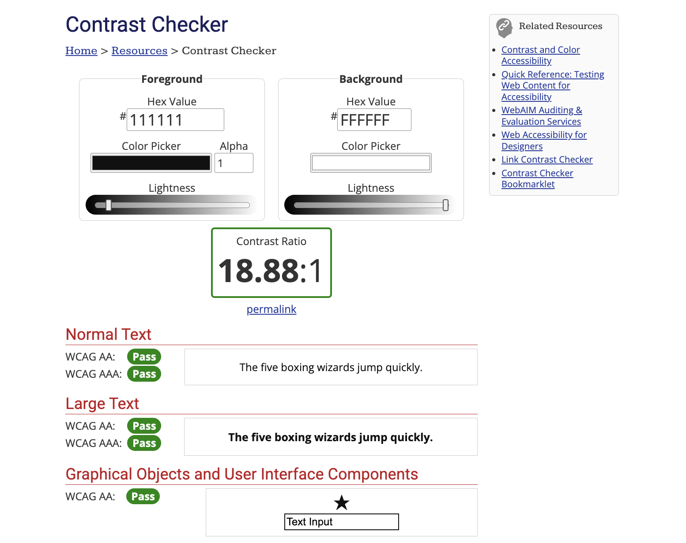 | ✅ Pass |
| `#666666` | `#FFFFFF` | 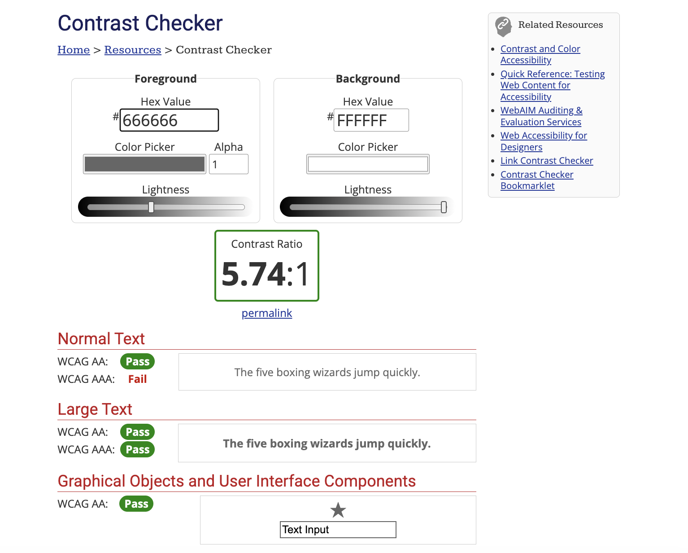 | ✅ Pass on normal text, ✅ Pass on large text |
| `#FF6B9D` | `#FFFFFF` | 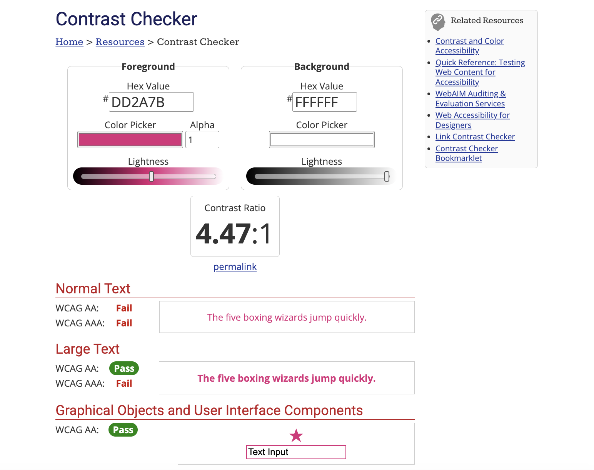 | ✅ Pass on large text/graphics |
| `#FFA751` | `#FFFFFF` | 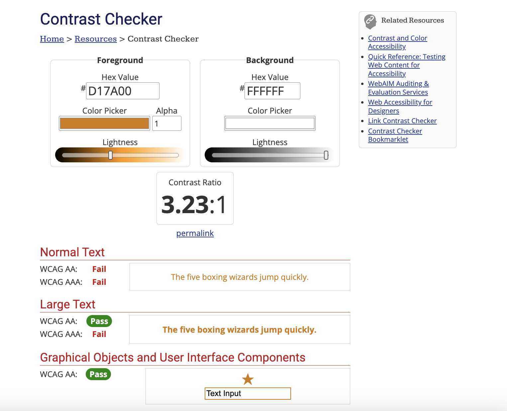 | ✅ Pass on large text/graphics |
| `#000000` | `#F5F5F5` | 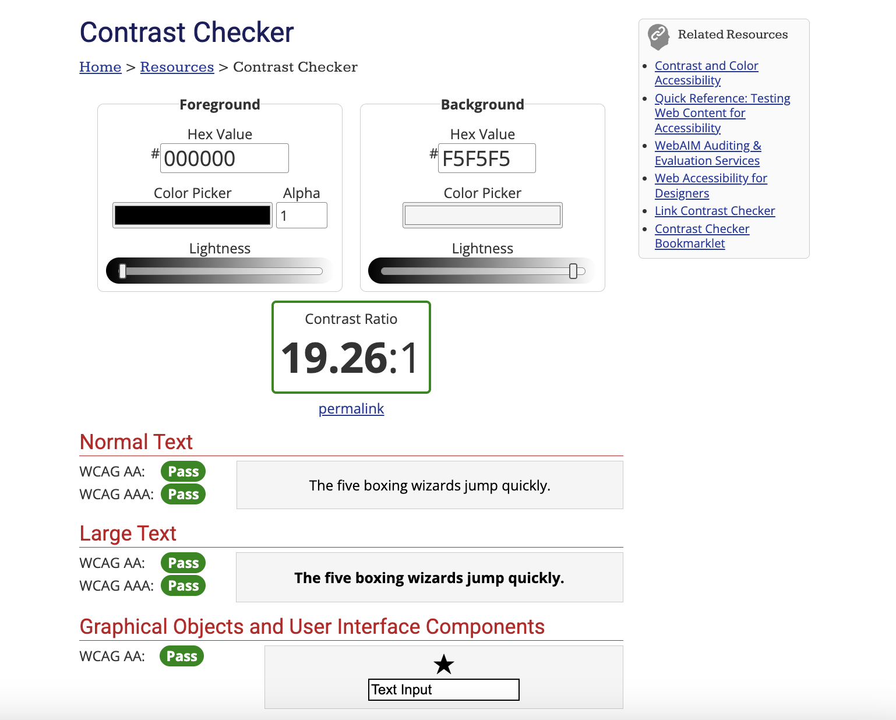 | ✅ Pass |
| `#FFFFFF` | `#000000` | 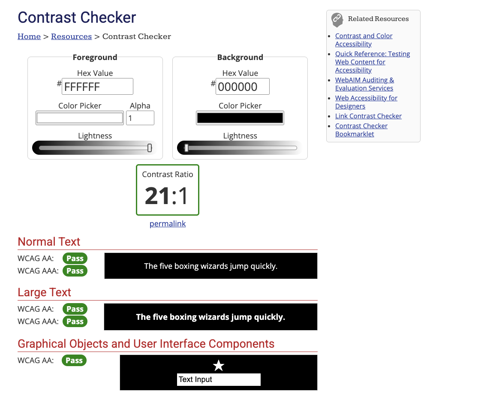 | ✅ Pass |

---

### Color Palette Reference

| Color | Hex Code | Usage |
|-------|----------|-------|
| Primary Pink | `#FF6B9D` | Category circle gradients, accents |
| Primary Orange | `#FFA751` | Category circle gradients, accents |
| Black | `#000000` | Primary text, header background |
| Dark Gray | `#111111` | Secondary headings |
| Medium Gray | `#666666` | Body text, descriptions |
| Light Gray | `#F5F5F5` | Section backgrounds |
| White | `#FFFFFF` | Main background, text on dark |

---

### Notes

- ✅ All text colors meet WCAG 2.1 AA standards for normal text (4.5:1 ratio)
- ✅ Gradient colors (pink/orange) are used for decorative graphics and icons
- ⚠️ Ensure pink and orange are not used for critical text information

# Testing User Stories – Supermarket E-commerce Store

| User Story ID | As a/an | I want to be able to ... | So that I can ... | How is this achieved? | Evidence | Pass/Fail | Notes |
|---------------|---------|-------------------------|-----------------|---------------------|---------|-----------|-------|

## Viewing and Navigation
1 | Guest | Easily navigate the site | Find supermarket products and information quickly | Responsive navigation, structured layout, and intuitive page links | Navigate homepage, category pages, and product pages | | |
2 | Guest | View a list of product categories | Browse items by type (All Products, Whole Foods, Frozen, Meat & Poultry, Hot Beverages, Cold Drinks, All Foods, All Drinks, Deals) | Homepage and navigation display category cards and links to filtered product pages | Clicking category cards navigates to correct filtered product listings | | |
3 | Shopper | View detailed product information | Decide if the item meets my needs | Product detail page shows product description, sizes, flavours, price, images, and stock availability | Product page correctly displays details | | |
4 | Shopper | View my cart at any time | Track what I plan to purchase | Bag icon updates in real-time and links to bag summary page | Cart icon shows number of items, links to cart | | |
5 | Shopper | See my cart total update in real-time | Track spending and avoid surprises at checkout | AJAX cart updates, mini bag on add-to-cart actions | Total price updates dynamically when items added/removed | | |
6 | Shopper | Access the site easily on mobile | Shop from any device conveniently | Fully responsive design with mobile-first layout and off-canvas nav | Test site on multiple devices and screen sizes | | |

## Registration & Accounts
7 | Guest | Register for an account | Make purchases and view order history | Custom Allauth templates with signup form | Successful registration and confirmation email received | | |
8 | Shopper | Receive confirmation after registering | Know that my account is active | Success message on site and email confirmation | User receives confirmation email and sees success page | | |
9 | Shopper | Log in and log out securely | Access my private information safely | Secure login/logout with redirect and CSRF protection | User can log in/out without errors | | |
10 | Shopper | View and update my profile | Change delivery address and personal info | Profile page with update form and validation | Profile changes saved correctly | | |
11 | Shopper | View my previous orders | Track what I’ve bought and reorder easily | Order history in profile, with links to past order receipts | User sees previous orders and details | | |
12 | Shopper | Reset my password | Recover account access if I forget credentials | Allauth password reset flow with secure token emails | Password reset email received and link works | | |

## Searching & Filtering
13 | Guest | Filter products by category or type | Quickly narrow down my search | Sidebar filters and query param filtering using categories: All Products, Whole Foods, Frozen, Meat & Poultry, Hot Beverages, Cold Drinks, All Foods, All Drinks, Deals | Filtering works correctly for each category | | |
14 | Guest | Search for a product by name or keyword | Find specific items faster | Search bar with Q object matching against name and description | Search returns accurate product results | | |
15 | Shopper | Sort products by price, name, or popularity | Choose the most relevant or affordable options | Sort dropdown updates results via query params | Sorting works correctly across all categories | | |

## Cart & Checkout
16 | Shopper | Add items to my cart | Save products I intend to buy | Add to cart button with size/flavour/variant selection | Product added to cart correctly | | |
17 | Shopper | Adjust quantities or remove items from cart | Finalise exactly what I want to purchase | Bag summary page allows quantity changes and deletions | Quantity changes update total correctly | | |
18 | Shopper | Proceed to a secure checkout | Buy items with confidence | Stripe integration, CSRF-protected forms | Checkout process completes without errors | | |
19 | Guest/Shopper | Checkout with or without an account | Make quick purchases when needed | Guest checkout enabled via session bag and order | Guest checkout works and creates order | | |
20 | Shopper | Enter payment details easily | Complete my order smoothly | Stripe card input with custom style, instant validation | Payment processed successfully | | |
21 | Shopper | Receive on-screen and email confirmation | Ensure the order was successful | Checkout success page and order confirmation email | Confirmation page and email received | | |
22 | Shopper | Know that my data is protected | Trust the site and continue using it | HTTPS, Stripe, and secure session handling | Secure checkout verified | | |

## Admin & Store Management
23 | Admin | Add new products to the store | Keep the shop up to date with new items | Admin panel product + variant forms with preview | Product appears on correct category page | | |
24 | Admin | Edit or update product info | Correct mistakes or make improvements | Admin panel and edit views for products | Product updates reflected on frontend | | |
25 | Admin | Delete a product | Remove items that are no longer for sale | Delete button in product admin with confirmation modal | Product removed from site | | |
26 | Admin | Monitor and manage product stock | Ensure products don’t oversell | Stock managed at variant level and updated per order | Inventory levels reflect orders correctly | | |
27 | Admin | View and manage incoming orders | Fulfil customer purchases efficiently | Orders visible in Django admin with line item breakdowns | Admin sees all order details | | |
28 | Admin | Access the admin panel securely | Manage store operations without public access | Admin login via Django admin with superuser access only | Admin login successful | | |

## Experience & Compliance
29 | All users | View accessibility-friendly content | Navigate the site with any device or ability | Contrast-checked colour palette, semantic HTML, alt text on images | Passes accessibility audit | | |
30 | All users | Receive clear feedback when something goes wrong | Know how to fix errors and complete actions | Flash messages and form validation feedback | Form errors and success messages displayed | | |
31 | All users | Contact the store via a form | Ask questions or report issues | Contact form with success/error messaging | Form submissions received correctly | | |
32 | All users | Read Terms & Conditions and Privacy Policy | Understand how my data is used and my rights | Dedicated privacy.html and terms.html pages, linked in footer | Pages accessible and readable | | |

# Manual Features Testing – Supermarket E-commerce Store
**Navbar (Header) – base.html**

| Feature | Expected Outcome | Testing Performed | Result | Pass/Fail |
|---------|-----------------|-----------------|--------|-----------|
| Store Logo (mobile & desktop) | Clicking the logo navigates to the home page (/) | Clicked the logo in both desktop and mobile views | Home page rendered successfully | ✅ Pass |
| Login Link | Navigates to /accounts/login/ | Clicked on the Login link from the user dropdown | User redirected to login page | ✅ Pass |
| Register Link | Navigates to /accounts/signup/ | Clicked on the Register link from the user dropdown | User redirected to signup page | ✅ Pass |
| All Products Category Link | Navigates to /products/?category=all-products | Clicked on All Products in category nav | Products filtered by All Products | ✅ Pass |
| Whole Foods Category Link | Navigates to /products/?category=whole-foods | Clicked on Whole Foods in category nav | Products filtered by Whole Foods | ✅ Pass |
| Frozen Category Link | Navigates to /products/?category=frozen | Clicked on Frozen in category nav | Products filtered by Frozen | ✅ Pass |
| Meat & Poultry Category Link | Navigates to /products/?category=meat-poultry | Clicked on Meat & Poultry in category nav | Products filtered by Meat & Poultry | ✅ Pass |
| Hot Beverages Category Link | Navigates to /products/?category=hot-beverages | Clicked on Hot Beverages in category nav | Products filtered by Hot Beverages | ✅ Pass |
| Cold Drinks Category Link | Navigates to /products/?category=cold-drinks | Clicked on Cold Drinks in category nav | Products filtered by Cold Drinks | ✅ Pass |
| Deals Category Link | Navigates to /products/?category=deals | Clicked on Deals in category nav | Products filtered by Deals | ✅ Pass |
| Search Icon | Toggles open the desktop search bar | Clicked the search icon (magnifying glass) in the navbar | Search bar appeared below the navbar | ✅ Pass |
| Account Icon (Guest) | Displays Login and Register links in dropdown | Clicked account icon while not logged in | Dropdown showed Login and Register links | ✅ Pass |
| Account Icon (Guest) → Register | Navigates to /accounts/signup/ | Clicked Register from the guest dropdown | Signup page loaded successfully | ✅ Pass |
| Account Icon (User) | Displays My Profile and Logout options | Logged in as a standard user and clicked account icon | Dropdown displayed My Profile and Logout | ✅ Pass |
| Account Icon (Admin) | Displays Product Management, My Profile, and Logout options | Logged in as an admin user and clicked account icon | Dropdown displayed Product Management, My Profile, and Logout | ✅ Pass |
| My Profile Link | Navigates to /profile/ | Clicked My Profile from the account dropdown (user) | Profile page loaded successfully | ✅ Pass |
| Logout Link (User) | Logs the user out and redirects | Clicked Logout from the dropdown (user) | User was logged out and redirected | ✅ Pass |
| Product Management (Admin) | Navigates to /products/add/ | Clicked Product Management from admin dropdown | Product creation form loaded | ✅ Pass |
| Logout Link (Admin) | Logs the admin out and redirects | Clicked Logout from the dropdown (admin) | Admin was logged out and redirected | ✅ Pass |
| Shopping Bag Icon | Navigates to /bag/ | Clicked the shopping bag icon in the navbar | Redirected to the bag page | ✅ Pass |

# ⛔️ Navbar (Header) – Negative Testing Scenarios

| Feature | Expected Outcome | Testing Performed | Result | Pass/Fail |
|---------|-----------------|-----------------|--------|-----------|
| Navbar links for unauthenticated users | Should only show Login/Register | Logged out and viewed navbar | Correct links displayed | ✅ Pass |
| Broken navigation | Manually edited link in DevTools to non-existent route | Got 404 error page | ✅ Pass |

# Homepage Content (Public) – index.html

| Feature | Expected Outcome | Testing Performed | Result | Pass/Fail |
|---------|-----------------|-----------------|--------|-----------|
| Shop Now CTA (Hero Banner) | Navigates to /products/ | Clicked Shop Now in the hero section | Redirected to /products/ | ✅ Pass |
| All Products Category Image | Navigates to /products/?category=all-products | Clicked All Products image card | Products filtered by All Products | ✅ Pass |
| Whole Foods Category Image | Navigates to /products/?category=whole-foods | Clicked Whole Foods image card | Products filtered by Whole Foods | ✅ Pass |
| Frozen Category Image | Navigates to /products/?category=frozen | Clicked Frozen image card | Products filtered by Frozen | ✅ Pass |
| Meat & Poultry Category Image | Navigates to /products/?category=meat-poultry | Clicked Meat & Poultry image card | Products filtered by Meat & Poultry | ✅ Pass |
| Hot Beverages Category Image | Navigates to /products/?category=hot-beverages | Clicked Hot Beverages image card | Products filtered by Hot Beverages | ✅ Pass |
| Cold Drinks Category Image | Navigates to /products/?category=cold-drinks | Clicked Cold Drinks image card | Products filtered by Cold Drinks | ✅ Pass |
| Deals Category Image | Navigates to /products/?category=deals | Clicked Deals image card | Products filtered by Deals | ✅ Pass |
| Newsletter Signup (valid email) | Submitting valid email shows toast confirmation | Entered valid email and clicked sign up | Toast message: Success! Thanks for signing up to our newsletter | ✅ Pass |
| Carousel controls: Previous button | Scrolls to previous slide | Clicked the previous arrow | Previous carousel slide shown | ✅ Pass |
| Carousel controls: Next button | Scrolls to next slide | Clicked the next arrow | Next carousel slide shown | ✅ Pass |
| Carousel indicators (dots) | Navigates to the correct slide | Clicked each dot below the carousel | Corresponding slide shown | ✅ Pass |

# ⛔️ Homepage Content (Public) – Negative Testing Scenarios

| Feature | Expected Outcome | Testing Performed | Result | Pass/Fail |
|---------|-----------------|-----------------|--------|-----------|
| Unauthenticated access | Site loads fully without login | Accessed homepage while logged out | All public sections loaded successfully | ✅ Pass |
| Newsletter Signup – No Input | Inline browser validation prevents submission | Clicked submit without entering email | Browser showed “Please fill in this field” | ✅ Pass |
| Newsletter Signup – Blank Space | Inline browser validation prevents submission | Entered space and clicked submit | Browser showed “Please fill in this field” | ✅ Pass |

# Footer (base.html)

| Feature | Expected Outcome | Testing Performed | Result | Pass/Fail |
|---------|-----------------|-----------------|--------|-----------|
| Website Link (Join Today / Branding) | Opens official store website in new tab | Clicked website link | Store website opened in a new browser tab | ✅ Pass |
| Email Link (Join Today section) | Opens default mail client with store email | Clicked store email link | Default mail client opened with address prefilled | ✅ Pass |
| Address Link (Join Today section) | Opens Google Maps location in new tab | Clicked store address link | Google Maps opened in a new browser tab | ✅ Pass |
| Shipping Policy Link (Helpful Links) | Navigates to /shipping | Clicked Shipping Policy under Helpful Links | Redirected to /shipping page | ✅ Pass |
| Facebook Icon (Follow Us) | Opens store Facebook page in new tab | Clicked Facebook icon | Facebook page opened in a new tab | ✅ Pass |
| Instagram Icon (Follow Us) | Opens store Instagram page in new tab | Clicked Instagram icon | Instagram page opened in a new tab | ✅ Pass |
| Terms & Conditions Link | Navigates to /terms | Clicked Terms & Conditions in footer | Redirected to /terms page | ✅ Pass |
| Privacy Policy Link | Navigates to /privacy | Clicked Privacy Policy in footer | Redirected to /privacy page | ✅ Pass |
| GitHub Link | Opens developer’s GitHub profile in new tab | Clicked GitHub link in footer | GitHub profile opened in new tab | ✅ Pass |

# ⛔️ Footer – Negative Testing Scenarios

| Feature | Expected Outcome | Testing Performed | Result | Pass/Fail |
|---------|-----------------|-----------------|--------|-----------|
| External links | All external links open in a new browser tab without affecting current session | Clicked each external link (store site, address, Facebook, Instagram, GitHub) | Each opened in a new tab and the original session remained intact | ✅ Pass |
| mailto: link | Opens user's default mail client without page reload or error | Clicked store email link | Mail app opened; no page disruption | ✅ Pass |
| Inactive or broken links | No broken or inactive links in footer | Manually clicked each footer link to confirm navigation | All links routed correctly; no 404 or inactive anchors found | ✅ Pass |
| Layout stability | Clicking footer links should not break layout or styling | Tested navigation back and forth from linked pages | Footer retained consistent styling across all linked pages | ✅ Pass |

# Products Page – (products.html)

| Feature | Expected Outcome | Testing Performed | Result | Pass/Fail |
|---------|-----------------|-----------------|--------|-----------|
| Sort By Dropdown | Selecting an option sorts the products accordingly (Name A–Z, Z–A, Price Low–High, High–Low) | Chose each sorting option and observed the order of displayed products | Products reordered as expected | ✅ Pass |
| Product Image Click | Clicking a product image navigates to the correct product detail page | Clicked several product images | Each navigated to the correct product detail view | ✅ Pass |
| Category Tag Click | Clicking a product's category tag filters products by that category | Clicked on category tags beneath products | Navigated to /products/?category=... and filtered view shown | ✅ Pass |
| Back to Top Button | Clicking the button scrolls the page smoothly to the top | Scrolled down the page and clicked the button | Page returned to the top as expected | ✅ Pass |

# Product Detail Page – (product_detail.html)

| Feature | Expected Outcome | Testing Performed | Result | Pass/Fail |
|---------|-----------------|-----------------|--------|-----------|
| Product Image Click | Clicking on the main product image opens it in a new tab | Clicked on product image | Full-size image opened in a new browser tab | ✅ Pass |
| Category Tag Click | Navigates to /products/?category=... for that product's category | Clicked the category tag under the product name | Correct category page loaded | ✅ Pass |
| Colour Dropdown | Selecting a colour updates the image preview (if available) | Selected each colour option | Correct image preview shown for each colour | ✅ Pass |
| Size Dropdown | Selected size remains selected when chosen | Selected a size from dropdown | Selection was retained | ✅ Pass |
| Quantity Plus Button | Increases quantity by 1 until stock level is reached, then disables | Clicked + repeatedly | Quantity increased and button disabled at stock limit | ✅ Pass |
| Quantity Minus Button with Over-limit Value | Tooltip informs user to reduce quantity | Manually entered quantity above stock and hovered | Tooltip appeared instructing user to lower quantity | ✅ Pass |
| Keep Shopping Button | Returns user to product list | Clicked on Keep Shopping | Redirected to /products/ | ✅ Pass |
| Add to Bag Button | Adds item to bag and shows success toast | Selected options, clicked Add to Bag | Item added and toast confirmed quantity | ✅ Pass |

# Bag Page – (bag.html)

| Feature | Expected Outcome | Testing Performed | Result | Pass/Fail |
|---------|-----------------|-----------------|--------|-----------|
| Quantity Plus Button | Increases quantity by 1 until reaching stock limit; lowering quantity re-enables button | Clicked plus repeatedly until stock limit reached | Quantity increased correctly; button disabled at stock limit; lowering quantity re-enabled it | ✅ Pass |
| Quantity Minus Button | Minus button disabled at 1; decreases quantity by 1 if greater than 1 | Added product to bag and clicked minus | Quantity decreased correctly; button disabled at 1 | ✅ Pass |
| Quantity Input Field | Entering value higher than stock triggers error toast | Entered quantity above stock | Error toast appeared showing stock level and advising correction | ✅ Pass |
| Update Link/Button | Changing quantity shows success toast; error toast if over stock | Updated a quantity within and above stock limits | Success toast shown within limits; error toast shown when exceeded | ✅ Pass |
| Remove Item Link | Removes product and shows success toast | Clicked Remove on item | Product removed and success toast displayed | ✅ Pass |
| Keep Shopping Button | Returns user to main products page | Clicked Keep Shopping | Redirected to /products/ | ✅ Pass |
| Secure Checkout Button | Takes user to checkout page | Clicked Secure Checkout | Redirected to /checkout/ | ✅ Pass |
| Checkout Button (Toast) | Toast includes product info, bag total, free delivery message, Go to Checkout button | Added product to bag, clicked Checkout on toast | Toast displayed correct details; Go to Checkout button redirected to /bag/ | ✅ Pass |

# Checkout Page – (checkout.html)

| Feature | Expected Outcome | Testing Performed | Result | Pass/Fail |
|---------|-----------------|-----------------|--------|-----------|
| Form validation | Submitting form with missing fields shows tooltip errors | Submitted form blank | Tooltip informed user to fill required fields | ✅ Pass |
| Save delivery information checkbox | Delivery info saved to profile when selected | Filled form, selected checkbox, completed checkout | Profile info updated correctly | ✅ Pass |
| Login link (not logged in) | Navigates to login page, retains bag contents | Clicked Login, logged in, returned to checkout | Logged in, redirected to home, bag contents retained | ✅ Pass |
| Register link (not logged in) | Allows registration before checkout, retaining bag contents | Clicked Register, created account | Redirected to home, logged in, bag contents available | ✅ Pass |
| Payment information validation | Invalid card numbers trigger real-time Stripe errors | Entered invalid test card number | Stripe displayed red error for invalid card | ✅ Pass |
| Complete Order button | Shows loading overlay and redirects to success page | Filled form, clicked Complete Order | Overlay appeared, redirected to Checkout Success page | ✅ Pass |

# Solved Issues & Bugs – Supermarket Store

| No | Bug Description | Solution | Screenshot |
|----|----------------|---------|-----------|
| 1 | Users could submit form fields containing leading/trailing spaces (e.g., "  John " or " test@example.com "), causing validation inconsistencies or messy data storage. | Added a `clean()` method in the OrderForm to trim whitespace from all string fields before validation, ensuring consistent and clean data entry. | Screenshot |
| 2 | Products without a colour field displayed an unnecessary dropdown on the product page. | Updated the template to show the colour dropdown only if colour variants exist. Admin inline forms now allow optional colour variants when creating/editing products. | Screenshot |
| 3 | Hover image swap animation triggered on products with only a single image, causing flicker. | Template updated to include `.image-swap-wrapper` only when a back image exists, so animation only triggers with both front and back images. | Screenshot |
| 4 | Product detail and listing pages showed incomplete pricing; variant prices were not reflected dynamically. | Updated views to calculate `min_price` and `max_price` using Django’s Min/Max annotations. Prices now update dynamically with variant selection via `variant_price_map` JSON in JS. | N/A |
| 5 | Adding non-variant products to the bag raised errors due to missing `.price` on Product objects. | Removed unused imports, adjusted logic to use `variant.price` where applicable, and added fallback for non-variant products. Lines split for clarity. | N/A |
| 6 | Only the first variant item in the bag displayed a "Remove" button; others lacked it. | Moved remove button outside the `` block and conditionally added variant data attributes only when present. | Screenshot |
| 7 | Non-variant products (e.g., grocery items like cold drinks or hot beverages) missing displayed price, leaving blank space. | Added fallback to render `product.price` using `floatformat` or display “Price coming soon” if price is None, ensuring all products show a price. | Screenshot |
| 8 | Submitting add product form with duplicate variant size/colour caused IntegrityError due to UNIQUE SKU constraint. | Added logic in `add_product` view to skip duplicate variant combinations before saving, so only unique variants are persisted. | Screenshot |
| 9 | Deleting a product from product detail page triggered immediate deletion with only toast notification, unlike the product list. | Added Bootstrap confirmation modal to product detail page, matching product list behavior for user confirmation before deletion. | Screenshot |
| 10 | Back-to-top arrow icon used `text-black`, invisible on dark footer backgrounds. | Changed icon class to `text-primary` for better contrast and visibility. | Screenshot |
| 11 | On mobile/tablet, the account icon was not intuitive, lacking clear options for sign in/out or account management. | Added authenticated/guest account links (My Profile, Logout, Sign Up, Sign In) into mobile off-canvas menu to mirror desktop flyout behavior and improve UX clarity. | Screenshot |

# Conclusion

Through **validation tools, automated test coverage, manual device/browser testing, and accessibility checks**, the supermarket e-commerce site has been rigorously tested to ensure a robust, user-friendly, and inclusive experience across platforms.  

**Areas for future improvement** include extended screen reader testing, broader JavaScript test coverage, and further optimisation of mobile navigation. Overall, the site meets the project’s functional and technical requirements, offering a **stable, scalable, and reliable foundation** for real-world online grocery shopping.